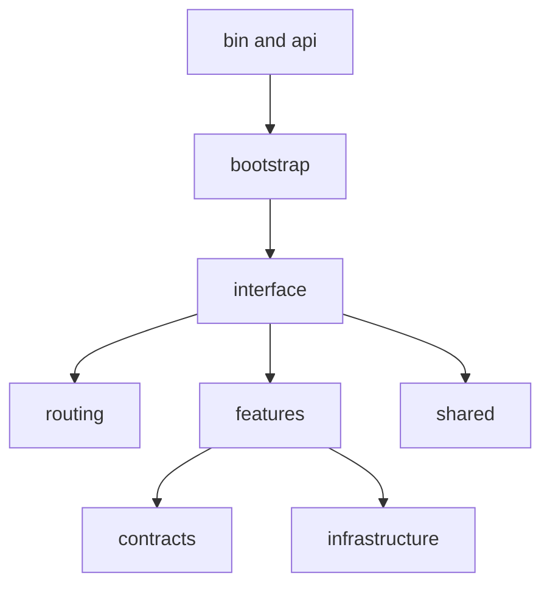

# Dependency Direction

Dependency direction in `bijux-cli` should flow toward stable contracts and
feature services, not from low-level modules back into top-level command
interfaces.

## Visual Summary

## Expected Direction Rules

- `bin` and `bootstrap` call interface and API facades
- `interface` orchestrates but should not reimplement feature logic
- `routing` normalizes and resolves routes without owning business state
- `features` implement domain behavior and consume contracts/infrastructure
- `contracts` stay dependency-light and reusable by all layers

## Code Anchors

- `crates/bijux-cli/src/lib.rs`
- `crates/bijux-cli/src/interface/cli/dispatch.rs`
- `crates/bijux-cli/src/routing/mod.rs`
- `crates/bijux-cli/src/features/mod.rs`
- `crates/bijux-cli/src/contracts/mod.rs`

## Anti-Patterns to Block

- handler modules importing deep implementation from unrelated features
- contract modules importing interface-specific behavior
- circular dependencies between interface and feature subtrees
- direct process side effects in parser-only modules

## Evidence Anchors

- architecture boundary tests under `crates/bijux-cli/tests/architecture/boundaries/`
- routing law tests under `crates/bijux-cli/tests/routing/laws/`

## Next Reads

- [Execution Model](execution-model.md)
- [Integration Seams](integration-seams.md)
- [Dependency Governance](../quality/dependency-governance.md)
