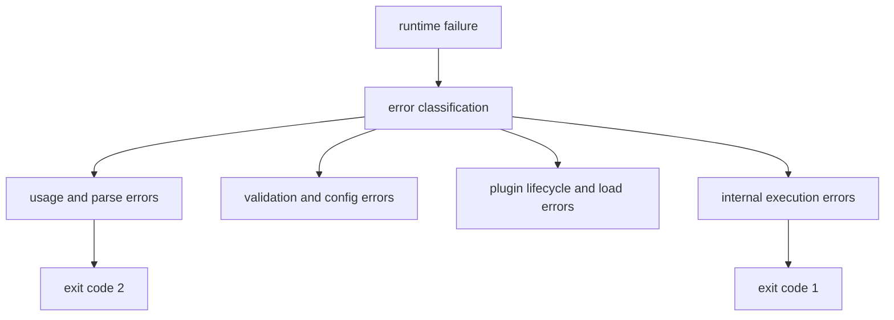

# Error Model

`bijux-cli` distinguishes usage failures, validation failures, plugin/runtime
failures, and internal execution failures. Error shaping is part of the command
contract because scripts depend on both payload shape and exit code.

## Visual Summary

## Error Surfaces

- parser errors for invalid flags, subcommands, and argument forms
- route errors for reserved/conflicting/unknown/ambiguous namespaces
- handler-level validation errors for config, history, memory, and plugin commands
- rendering errors when requested output cannot be encoded safely

## Code Anchors

- `crates/bijux-cli/src/interface/cli/dispatch.rs`
- `crates/bijux-cli/src/interface/cli/dispatch/policy.rs`
- `crates/bijux-cli/src/routing/parser.rs`
- `crates/bijux-cli/src/routing/registry.rs`
- `crates/bijux-cli/src/contracts/envelope.rs`

## Error Contract Rules

- include a clear user-facing message in stderr payloads
- preserve usage-class failures for user-input mistakes
- avoid reclassifying stable errors without compatibility review
- keep unknown-route suggestions deterministic and bounded

## Next Reads

- [Data Contracts](../interfaces/data-contracts.md)
- [Failure Recovery](../operations/failure-recovery.md)
- [Invariants](../quality/invariants.md)
