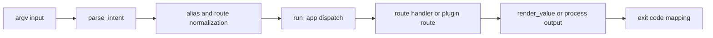

# Execution Model

`bijux-cli` treats each invocation as a deterministic run: parse, normalize,
execute, render, and exit. This model allows command behavior to remain
predictable across CLI and REPL usage.

## Visual Summary

## Execution Steps

1. Decode argv and optional REPL interception.
2. Parse intent with global flags recognized regardless of placement.
3. Resolve fast-path help/version and known-tool delegation cases.
4. Route to root, cli, config, history, memory, plugins, or install handlers.
5. Render output respecting format and pretty settings.
6. Emit stdout/stderr payloads and return final exit code.

## Code Anchors

- `crates/bijux-cli/src/bootstrap/run.rs`
- `crates/bijux-cli/src/interface/cli/dispatch.rs`
- `crates/bijux-cli/src/interface/cli/dispatch/route_exec.rs`
- `crates/bijux-cli/src/routing/parser.rs`
- `crates/bijux-cli/src/kernel/pipeline.rs`

## Execution Guarantees

- usage and parser failures are surfaced with usage-class exit behavior
- help rendering can short-circuit without running full command handlers
- quiet mode suppresses output streams but preserves command exit outcome
- unknown routes include correction hints when similarity matches exist

## Executable Contracts

- `crates/bijux-cli/tests/integration/cli/root/flag_normalization_laws.rs`
  checks global-flag normalization and usage failures.
- `crates/bijux-cli/tests/integration/cli/root/root_command_coverage.rs` checks
  quiet output, exit-code discipline, help failures, and route suggestions.
- `crates/bijux-cli/tests/integration/cli/root/bin_core_integration.rs` checks
  that binary and in-process execution agree on streams and exit outcomes.

## Next Reads

- [Error Model](error-model.md)
- [Operator Workflows](../interfaces/operator-workflows.md)
- [Failure Recovery](../operations/failure-recovery.md)
