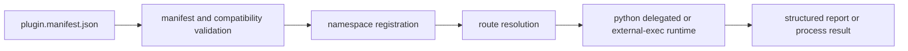

# Extensibility Model

`bijux-cli` extensibility is route-centric. Extensions are integrated through
plugin manifests, namespace registration, compatibility checks, and entrypoint
execution contracts.

## Visual Summary

## Extensibility Layers

- manifest schema and field validation
- reserved namespace and alias conflict protection
- compatibility range checks against host semver
- lifecycle toggles (`enable`, `disable`, `uninstall`)
- diagnostics surfaces (`doctor`, `explain`, `schema`, `where`)

## Code Anchors

- `crates/bijux-cli/src/contracts/plugin.rs`
- `crates/bijux-cli/src/features/plugins/manifest.rs`
- `crates/bijux-cli/src/features/plugins/operations.rs`
- `crates/bijux-cli/src/features/plugins/runtime.rs`
- `crates/bijux-cli/src/routing/registry.rs`

## Extensibility Constraints

- no full sandbox isolation guarantee
- extension namespaces must not collide with reserved roots
- compatibility declarations must be semver-parseable
- entrypoint execution errors must remain inspectable

## Next Reads

- [Artifact Contracts](../interfaces/artifact-contracts.md)
- [Security and Safety](../operations/security-and-safety.md)
- [Known Limitations](../quality/known-limitations.md)
