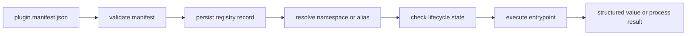

# Extensibility Model

`bijux-cli` extends its command tree by registering a validated plugin
namespace. A plugin does not patch the parser or link code into the host. Its
manifest declares ownership of a route, and the runtime dispatches that route
to a Python callable or an external executable.

This design keeps command ownership inspectable. It does not make plugin code
trusted or isolated.

## Lifecycle And Authority

Each stage has one source of authority:

| Stage | Authority | What it decides |
| --- | --- | --- |
| declaration | `plugin.manifest.json` | identity, version, route names, compatibility range, kind, and entrypoint |
| validation | `features/plugins/manifest.rs` | whether the declaration is structurally valid and compatible with this host |
| installation | plugin registry | which validated record is installed and its lifecycle state |
| routing | command registry | whether a namespace or alias resolves without colliding with a host-owned route |
| execution | `features/plugins/runtime.rs` | which runtime starts, which arguments are forwarded, and how the result is returned |

Validation is intentionally earlier than execution. A malformed compatibility
range, reserved route, unsupported kind, or invalid entrypoint is rejected
before the plugin can become a routable command.

## Manifest Contract

The accepted contract is manifest version `v2` with schema version `v2`.
Validation requires:

- a semantic plugin version
- a lowercase ASCII namespace made from letters, digits, and single hyphens
- aliases with the same syntax and no duplicates
- no collision with core, reserved, official-product, or known Bijux tool
  namespaces
- a semantic host-version interval with an inclusive lower bound and optional
  exclusive upper bound
- a non-empty entrypoint valid for the declared plugin kind

The compatibility interval is checked against the running CLI version. It is
not advisory metadata.

## Execution Kinds

| Manifest kind | Entrypoint | Runtime behavior | Support |
| --- | --- | --- | --- |
| `python` | `module:callable` | imports the callable with Python 3.11 or newer and passes command arguments | supported |
| `delegated` | `module:callable` | follows the same Python bridge contract | supported |
| `external-exec` | executable path | starts the executable and forwards command arguments | supported |
| `native` | native entrypoint | none | rejected as unsupported |

Python plugins return a JSON-serializable value through a bridge envelope.
External executables return their exit code, standard output, and standard
error. Both execute as child processes; neither kind runs inside a security
sandbox.

## State And Routing

Installation records the validated manifest, source, trust level, checksum, and
lifecycle state. Route execution re-reads that record. Disabled, broken, and
incompatible plugins are refused rather than invoked.

Aliases are alternate references to the same canonical namespace. They do not
create another plugin identity, bypass compatibility checks, or acquire a
separate lifecycle.

Operational commands expose the registry rather than hiding it:

- `plugins list` and `plugins inspect` report records and state counts
- `plugins doctor` checks the installed record against current runtime
  conditions
- `plugins enable` refuses a plugin with a current load diagnostic
- `plugins disable` keeps the record but prevents execution
- `plugins uninstall` removes the registered namespace

## Deliberate Boundaries

- A trust classification records operator intent; it is not a signature or
  provenance proof.
- A manifest checksum detects a changed manifest; it does not attest the
  entrypoint or its dependencies.
- Namespace validation protects command ownership; it does not constrain what
  an invoked process can access.
- The host controls timeout and environment forwarding, but the child still
  runs with the operating-system identity of the CLI process.

Read [Security and Safety](../operations/security-and-safety.md) before
installing code from outside your trust boundary.

## Implementation Map

- `crates/bijux-cli/src/contracts/plugin.rs` defines the public manifest and
  lifecycle types.
- `crates/bijux-cli/src/features/plugins/manifest.rs` validates declarations.
- `crates/bijux-cli/src/features/plugins/operations.rs` owns lifecycle
  operations and reports.
- `crates/bijux-cli/src/features/plugins/runtime.rs` launches plugin processes.
- `crates/bijux-cli/src/routing/registry.rs` protects and resolves command
  routes.

## Next Reads

- [Artifact Contracts](../interfaces/artifact-contracts.md)
- [Security and Safety](../operations/security-and-safety.md)
- [Known Limitations](../quality/known-limitations.md)
