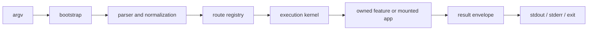

# CLI Architecture

`bijux-cli` is a root command runtime, not a collection of unrelated command
handlers. Every invocation moves through one routing and execution boundary so
aliases, mounted apps, plugins, output envelopes, streams, and exit codes remain
consistent.

## Request Path

| Boundary | Owner | Required property |
| --- | --- | --- |
| process startup | `bootstrap/` | one conversion from process inputs to runtime invocation |
| grammar and aliases | `routing/parser.rs` | deterministic normalization before route lookup |
| built-in and extension names | `routing/registry.rs` | collision-free, order-independent resolution |
| execution policy | `kernel/` | one path for context, policy, and result handling |
| command behavior | `features/` and mounted app contracts | product behavior stays outside the root grammar |
| public response | `contracts/` and `interface/` | JSON meaning, stream choice, and exit status agree |
| filesystem and processes | `infrastructure/` | side effects remain behind explicit adapters |

## Route A Change

| Change | Read first | Verify first |
| --- | --- | --- |
| global flag, alias, or command grammar | [Root CLI Architecture](root-cli-architecture.md) and [Execution Model](execution-model.md) | parser intent, route-law, and command-tree contracts |
| plugin or mounted-app namespace | [Extensibility Model](extensibility-model.md) | namespace policy, registry stability, and lifecycle integration |
| config, history, registry, or state path | [State and Persistence](state-and-persistence.md) | state diagnostics and rollback/resilience tests |
| JSON field, human rendering, stream, or exit code | [Error Model](error-model.md) | envelope compatibility, SDK surface, and binary/core parity |
| Python bridge behavior | [Integration Seams](integration-seams.md) | bridge ownership and Python equivalence contracts |
| module dependency | [Dependency Direction](dependency-direction.md) | architecture boundary tests |

## Non-Negotiable Boundaries

- Parsing determines intent; it does not execute domain behavior.
- Registration order cannot change route ownership or help output.
- A plugin namespace cannot shadow a built-in route, official product, alias,
  or another normalized namespace.
- Human and JSON output can render differently but cannot disagree on success,
  failure class, or payload meaning.
- Persistent mutations must either complete coherently or retain enough state
  for diagnosis and recovery.
- The Python distribution and mounted apps consume the root contract; they do
  not define alternate command semantics.

## Review Evidence

Architecture claims in this section are backed by:

- `crates/bijux-cli/tests/architecture.rs`
- `crates/bijux-cli/tests/routing.rs`
- `crates/bijux-cli/tests/integration.rs`
- `contracts/schemas/output-envelope-v1.schema.json`
- generated command and configuration references checked by repository tests

Use [Architecture Risks](architecture-risks.md) when a change crosses more than
one boundary or can invalidate automation, persisted state, or extension trust.
Use the [CLI Surface](../interfaces/cli-surface.md) when the question is about
supported caller-visible behavior rather than implementation ownership.
