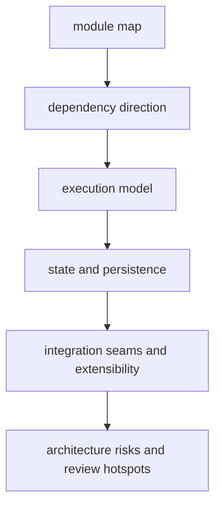

# Architecture

The architecture section describes how `bijux-cli` is assembled: module
boundaries, dependency flow, execution pipeline, persistence touchpoints,
integration seams, and risk areas.

## Visual Summary

## Primary Code Anchors

- `crates/bijux-cli/src/lib.rs`
- `crates/bijux-cli/src/bootstrap/`
- `crates/bijux-cli/src/routing/`
- `crates/bijux-cli/src/interface/`
- `crates/bijux-cli/src/features/`
- `crates/bijux-cli/src/infrastructure/`

## Pages In This Section

- [Module Map](module-map.md)
- [Dependency Direction](dependency-direction.md)
- [Execution Model](execution-model.md)
- [State and Persistence](state-and-persistence.md)
- [Integration Seams](integration-seams.md)
- [Error Model](error-model.md)
- [Extensibility Model](extensibility-model.md)
- [Code Navigation](code-navigation.md)
- [Architecture Risks](architecture-risks.md)
