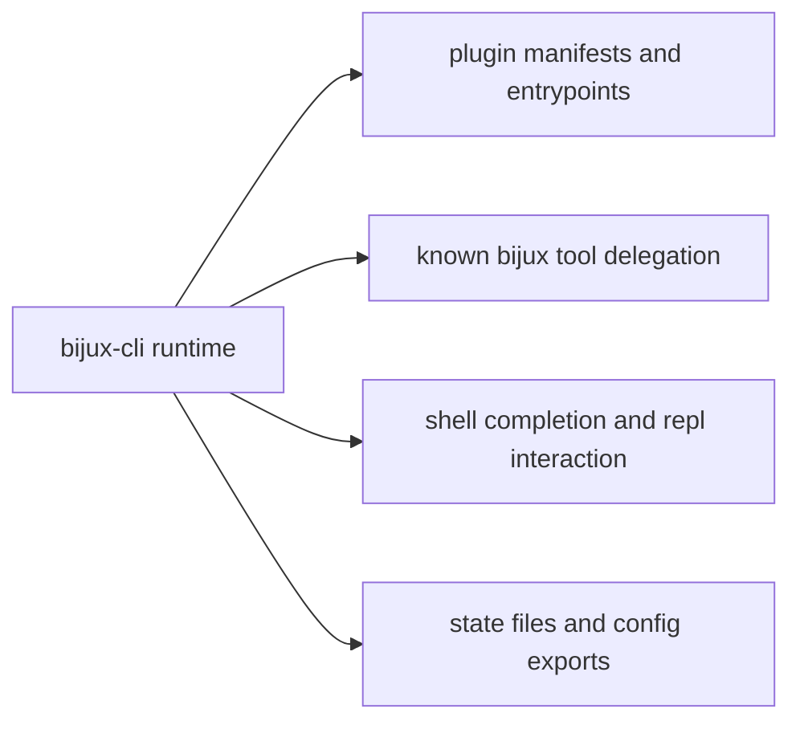

# Integration Seams

Integration seams are where `bijux-cli` exchanges behavior with external tools,
plugin entrypoints, shell environments, and adjacent workspace products.

## Visual Summary

## Major Seams

- plugin install/inspect/check/execute flows
- delegation to known product binaries when route policy requires handoff
- shell completion generation and installation hints
- config import/export and state-path diagnostics
- documentation and audit inventory reporting

## Code Anchors

- `crates/bijux-cli/src/interface/cli/dispatch/delegation.rs`
- `crates/bijux-cli/src/interface/cli/handlers/plugins.rs`
- `crates/bijux-cli/src/features/plugins/runtime.rs`
- `crates/bijux-cli/src/features/install/completion.rs`
- `crates/bijux-cli/src/interface/cli/handlers/cli.rs`

## Seam Rules

- keep seam inputs explicit and validated before execution
- preserve stable error categories when seam handoff fails
- expose diagnostics payloads instead of silent fallback behavior
- isolate seam-specific logic from core parser/route model contracts

## Next Reads

- [Extensibility Model](extensibility-model.md)
- [Deployment Boundaries](../operations/deployment-boundaries.md)
- [Risk Register](../quality/risk-register.md)
