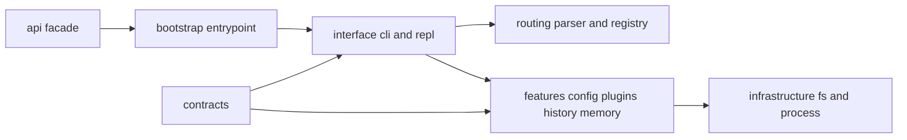

# Module Map

`bijux-cli` is intentionally layered so parsing, routing, runtime features,
interfaces, and shared contracts can evolve without collapsing into one large
handler module.

## Visual Summary

## Module Families

- `api/`: public facade modules used by callers and tests
- `bootstrap/`: process startup and stream emission wiring
- `interface/`: CLI dispatch, handlers, help rendering, REPL behavior
- `routing/`: parser, route catalog, alias rewrites, plugin route registry
- `features/`: domain logic for config, install, diagnostics, history, memory, plugins
- `contracts/`: typed payload, manifest, envelope, and schema contracts
- `infrastructure/`: filesystem stores, process helpers, environment access
- `shared/`: output rendering, telemetry, path/time/version helpers

## Code Anchors

- `crates/bijux-cli/src/lib.rs`
- `crates/bijux-cli/src/interface/cli/`
- `crates/bijux-cli/src/interface/repl/`
- `crates/bijux-cli/src/features/`
- `crates/bijux-cli/src/contracts/`

## Review Guidance

When code moves across module families, treat that move as architectural work and
review for dependency direction, test coverage, and API-surface impact.

## Next Reads

- [Dependency Direction](dependency-direction.md)
- [Code Navigation](code-navigation.md)
- [Public Imports](../interfaces/public-imports.md)
