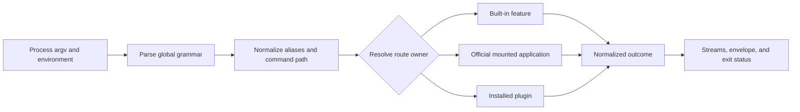

# Root CLI Architecture

`bijux` is intentionally a root router, not a monolithic command implementation.
The root process owns only the parts that must stay uniform across every product
and plugin surface.

Only the selected owner implements product behavior. The root pipeline keeps
route resolution and the externally observable result consistent.

## Root Responsibilities

- parse global flags and normalize aliases
- resolve built-in, official-app, and plugin namespaces
- enforce output envelopes and exit-code mapping
- delegate product-specific execution without rewriting payload semantics
- keep root help, suggestions, and diagnostics consistent

## Runtime Layers

1. `src/bootstrap/`: process entrypoint and stream wiring
2. `src/routing/`: grammar, normalization, registry, and suggestions
3. `src/interface/cli/`: root command handlers and help rendering
4. `src/kernel/`: execution pipeline and policy application
5. `src/features/`: domain implementations for config, plugins, install, and diagnostics

## Ownership At Each Layer

| Layer | May decide | Must not decide |
| --- | --- | --- |
| bootstrap | argv acquisition, stream writes, final process status | command semantics |
| parser | valid root grammar and typed arguments | installed plugin behavior |
| route registry | canonical owner, aliases, collisions, suggestions | owner-specific business logic |
| kernel | execution policy, lifecycle normalization, cancellation and panic handling | package publication or application semantics |
| feature or mount | owned command behavior | another namespace's route law |
| renderer | human or machine representation | whether execution succeeded |

This separation keeps CLI, REPL, Python bridge, SDK harness, and native process
entrypoints on one semantic path.

## Delegation Rules

- built-in root commands stay inside `bijux-cli`
- official apps route through mount descriptors
- Python and Rust mounted apps must still emit root-compatible JSON envelopes
- plugins stay behind manifest, lifecycle, namespace, and runtime checks

Official applications and plugins do not share trust status. Official
namespaces are reserved from the product registry. Plugins are local
code-execution decisions and cannot shadow built-ins, official products, root
aliases, or another extension.

## Result Invariants

- Route lookup is deterministic for the same normalized registry.
- Human rendering uses stdout for successful primary output and stderr for
  diagnostics and failure.
- Machine output preserves the governed envelope and does not mix diagnostic
  prose into stdout.
- Delegated process exit status and streams remain observable.
- Panic, cancellation, timeout, and malformed structured output cannot become
  success through rendering.
- Quiet or color policy changes presentation, not status or payload meaning.

## Architecture Smells

- adding product subcommands directly to the root parser;
- maintaining a second alias or command inventory in Python;
- loading plugin state for unrelated built-in commands without need;
- parsing delegated stderr to invent a successful structured result;
- placing filesystem or process effects in route discovery;
- widening an SDK helper into an alternate runtime authority.

## Review Questions

- does the change belong at the root, or inside an app/plugin surface?
- does it preserve alias normalization and route determinism?
- does it keep stdout/stderr and exit-code behavior stable?
- does it avoid leaking product-specific behavior into the root parser?
- does every entrypoint still converge on the same runtime contract?
- does the change preserve reserved and collision-free namespace ownership?
