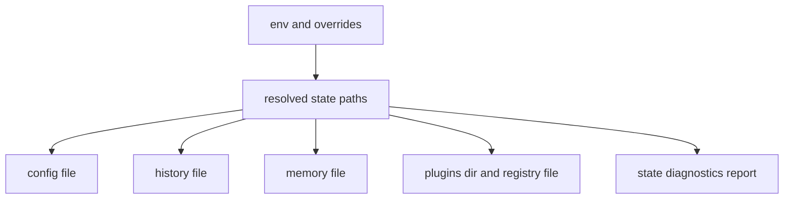

# State and Persistence

`bijux-cli` persists operational state for config, history, memory, and plugin
registry data. State-path resolution and diagnostics are first-class runtime
concerns because they directly affect command behavior.

## Visual Summary

## Persisted Artifacts

- configuration entries and exports
- history command records
- memory key-value state
- plugin manifests and registry lifecycle metadata
- compatibility path metadata for runtime installation behavior

## Code Anchors

- `crates/bijux-cli/src/features/diagnostics/state_paths.rs`
- `crates/bijux-cli/src/features/config/operations.rs`
- `crates/bijux-cli/src/features/history/operations.rs`
- `crates/bijux-cli/src/features/memory/operations.rs`
- `crates/bijux-cli/src/features/plugins/operations.rs`

## Persistence Rules

- file reads and writes must preserve deterministic command outcomes
- diagnostics should surface missing, corrupt, or conflicting state explicitly
- config commands should report source paths in structured results
- plugin registry mutations must remain auditable and reversible

## Next Reads

- [Configuration Surface](../interfaces/configuration-surface.md)
- [Diagnostics Guide](../operations/diagnostics-guide.md)
- [Known Limitations](../quality/known-limitations.md)
