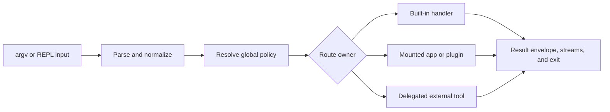

# Capability Map

`bijux` is a command runtime with one route model across the executable, REPL,
Python launcher, mounted applications, and plugins. It parses and normalizes
intent before execution, identifies the route owner, then preserves the result
contract appropriate to that owner.

## Operational Capabilities

| Capability | Operator result | Acceptance evidence |
| --- | --- | --- |
| command admission | deterministic argv parsing, alias normalization, global policy, and help | canonical route and stable usage or encoding classification |
| built-in execution | config, history, memory, diagnostics, plugin lifecycle, and REPL operations | typed result, owned state mutation when applicable, streams, and exit status |
| mounted applications | official product routes composed under the root runtime contract | mount identity, supported protocol, application result, and host envelope |
| plugins | discovered and installed namespaces with validated manifests and bounded lifecycle operations | registry entry, manifest and entrypoint validation, checksum policy, native process result |
| delegated tools | known external programs invoked without pretending their output is built-in | resolved executable identity and preserved child streams and status |
| machine output | deterministic JSON or YAML for documented built-in surfaces | schema/versioned envelope and nonzero status on failure |
| diagnostics | effective paths, configuration provenance, installation, state, bridge, and extension health | explicit findings from `status`, `doctor`, `audit`, and route-specific diagnostics |

## Capability Routing

Parsing and policy resolution are shared, but execution trust differs by
owner. Built-ins run inside the native runtime. Mounted apps and plugins obey
manifest and routing contracts but may execute trusted external code.
Delegated tools retain their own behavior and output contract where the route
explicitly delegates.

## Choose The Right Surface

| Need | Start with | Do not assume |
| --- | --- | --- |
| inspect runtime health or paths | `status`, `doctor`, `audit`, and `cli paths` | a command on `PATH` is the intended installation |
| manage layered settings | `config list`, `config explain`, and `config validate` | a stored value is the effective value |
| automate stable output | `--format json --no-pretty` and the command envelope contract | human text is a stable machine schema |
| add product commands | mounted app descriptors and app SDK | a plugin route becomes a built-in compatibility promise |
| extend trusted local behavior | plugin lifecycle and manifest surfaces | plugin execution is sandboxed |
| execute a DAG | the separately installed `bijux-dag` product | the root CLI embeds the DAG runtime |

## Trust Boundaries

- Manifest validity establishes structure and declared identity; it does not
  make plugin code trusted or sandboxed.
- A mounted product retains its owning semantics even though the root runtime
  provides routing and envelope integration.
- Delegation preserves an external tool's process contract; it does not convert
  that tool into a stable built-in API.
- A successful route proves one execution under the observed state, not the
  health of every plugin, bridge, or installation channel.
- `bijux-dag` remains a separately installed product and execution authority.

## Code Anchors

- `crates/bijux-cli/src/routing/parser.rs`
- `crates/bijux-cli/src/routing/model.rs`
- `crates/bijux-cli/src/interface/cli/handlers/`
- `crates/bijux-cli/src/interface/repl/`
- `crates/bijux-cli/src/shared/output.rs`
- `crates/bijux-cli/src/features/diagnostics/`

## Capability Edges To Remember

- plugin execution is intentionally unsandboxed and trust-based
- delegated known-tool routes preserve external tool output contracts
- formatting options change rendering, not semantic contract meaning
- Python and Rust distributions expose the same command contract; they do not
  create separate semantics
- a discovered extension is not trusted merely because its manifest is valid

## Authorities

- [Domain Language](domain-language.md)
- [CLI Interfaces](../interfaces/index.md)
- [Module Map](../architecture/module-map.md)
- [CLI Surface](../interfaces/cli-surface.md)
