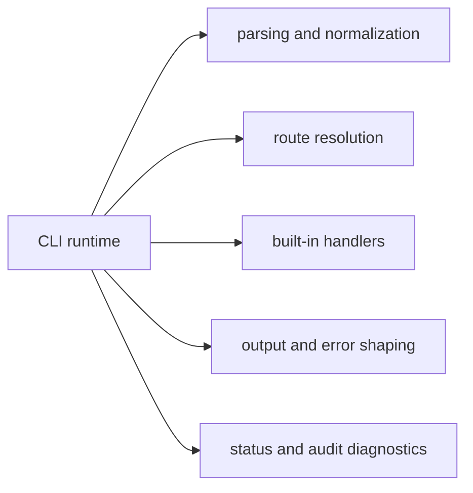

# Capability Map

This page explains what `bijux-cli` is meant to do before it explains how the
code is arranged.

The map is useful because it separates first-class runtime capabilities from the
implementation details that support them.

## Capability Map

## Capability Inventory

- Parse argv and normalize command intent
- Resolve route ownership among built-ins, aliases, and plugins
- Execute built-in handlers for runtime, config, memory, history, and plugin flows
- Generate text, JSON, and YAML payloads with deterministic rendering policy
- Emit usage/internal error classes with stable exit-code mapping
- Run interactive REPL with shared command semantics

## Code Anchors

- `crates/bijux-cli/src/routing/parser.rs`
- `crates/bijux-cli/src/routing/model.rs`
- `crates/bijux-cli/src/interface/cli/handlers/`
- `crates/bijux-cli/src/interface/repl/`
- `crates/bijux-cli/src/shared/output.rs`
- `crates/bijux-cli/src/features/diagnostics/`

## Capability Edges

- plugin execution is intentionally unsandboxed and trust-based
- delegated known-tool routes preserve external tool output contracts
- formatting options change rendering, not semantic contract meaning

## Questions This Page Answers

- what a user or automation script can expect from the current CLI runtime
- which features are first-class capabilities versus implementation details
- where to start code review for each major command domain

## Reading Rule

Use this page when the question is what the CLI is responsible for before
looking at package, module, or command-level detail.

## Next Reads

- [Domain Language](domain-language.md)
- [Module Map](../architecture/module-map.md)
- [CLI Surface](../interfaces/cli-surface.md)
