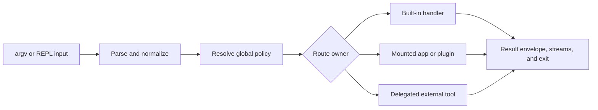

# Capability Map

Use this page when you want the fastest honest picture of what `bijux` can do
for a reader today, before you drop into modules, packages, or test suites.

`bijux` is a command runtime, not just a binary name. Its value is in how it
parses commands predictably, routes work, executes built-in runtime features,
and returns stable output that operators and automation can trust.

## What Readers Usually Come Here To Confirm

| Capability area | What you can expect |
| --- | --- |
| command handling | predictable argv parsing, route normalization, aliases, and help behavior |
| runtime features | built-in flows for config, history, memory, diagnostics, plugins, and REPL work |
| output contracts | stable text, JSON, and YAML rendering with explicit exit semantics |
| plugin integration | discovery, manifest validation, lifecycle control, and route mounting |
| runtime diagnostics | status and audit views that help explain the state of the installed runtime |

## Capability Routing

Parsing and policy resolution are shared, but execution trust differs by
owner. Built-ins run inside the native runtime. Mounted apps and plugins obey
manifest and routing contracts but may execute trusted external code.
Delegated tools retain their own behavior and output contract where the route
explicitly delegates.

## Core Capability Inventory

- Parse argv and normalize command intent
- Resolve route ownership among built-ins, aliases, and plugins
- Execute built-in handlers for runtime, config, memory, history, and plugin flows
- Generate text, JSON, and YAML payloads with deterministic rendering policy
- Emit usage/internal error classes with stable exit-code mapping
- Run interactive REPL with shared command semantics

## Choose The Right Surface

| Need | Start with | Do not assume |
| --- | --- | --- |
| inspect runtime health or paths | `status`, `doctor`, `audit`, and `cli paths` | a command on `PATH` is the intended installation |
| manage layered settings | `config list`, `config explain`, and `config validate` | a stored value is the effective value |
| automate stable output | `--format json --no-pretty` and the command envelope contract | human text is a stable machine schema |
| add product commands | mounted app descriptors and app SDK | a plugin route becomes a built-in compatibility promise |
| extend trusted local behavior | plugin lifecycle and manifest surfaces | plugin execution is sandboxed |
| execute a DAG | the separately installed `bijux-dag` product | the root CLI embeds the DAG runtime |

## What This Map Is Not Saying

- It is not claiming that plugins are a hardened trust boundary.
- It is not claiming that every repository workflow belongs to `bijux`.
- It is not replacing the CLI surface reference when you need exact command
  contracts.

## Code Anchors

- `crates/bijux-cli/src/routing/parser.rs`
- `crates/bijux-cli/src/routing/model.rs`
- `crates/bijux-cli/src/interface/cli/handlers/`
- `crates/bijux-cli/src/interface/repl/`
- `crates/bijux-cli/src/shared/output.rs`
- `crates/bijux-cli/src/features/diagnostics/`

## Capability Edges To Remember

- plugin execution is intentionally unsandboxed and trust-based
- delegated known-tool routes preserve external tool output contracts
- formatting options change rendering, not semantic contract meaning
- Python and Rust distributions expose the same command contract; they do not
  create separate semantics
- a discovered extension is not trusted merely because its manifest is valid

## Continue Reading

- [Domain Language](domain-language.md)
- [CLI Interfaces](../interfaces/index.md)
- [Module Map](../architecture/module-map.md)
- [CLI Surface](../interfaces/cli-surface.md)
