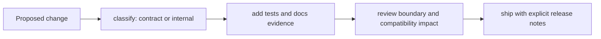

# Change Principles

`bijux-cli` evolves frequently, but contract-bearing behavior should move under
explicit rules. These principles keep command stability and docs trust intact.

## Visual Summary

## Principles

- classify changes by external contract impact before implementation starts
- keep docs, tests, and source updates in one coherent change set
- preserve deterministic parsing and exit semantics for existing commands
- avoid hidden behavior changes through convenience aliases or implicit defaults
- prefer additive paths and explicit deprecation windows over silent rewrites

## High-Risk Change Areas

- routing and alias rewrites in `routing/model.rs` and `routing/registry.rs`
- parser and global flag behavior in `routing/parser.rs`
- stream routing and rendering behavior in `interface/cli/dispatch.rs`
- plugin lifecycle and compatibility checks in `features/plugins/`

## Code Anchors

- `crates/bijux-cli/src/routing/model.rs`
- `crates/bijux-cli/src/routing/parser.rs`
- `crates/bijux-cli/src/interface/cli/dispatch.rs`
- `crates/bijux-cli/tests/routing/`
- `crates/bijux-cli/tests/integration/`

## Release-Safe Rule

If a scriptable behavior changes, update the docs page that defines it, add or
update the related test, and include explicit compatibility notes in the same
review thread.

## Next Reads

- [Change Validation](../quality/change-validation.md)
- [Review Checklist](../quality/review-checklist.md)
- [Release and Versioning](../operations/release-and-versioning.md)
