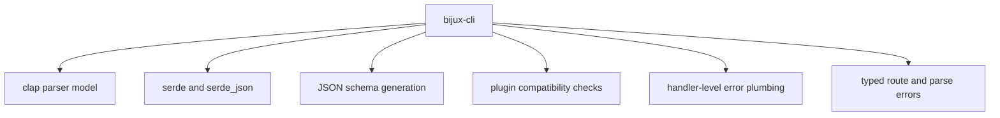

# Dependencies and Adjacencies

`bijux-cli` depends on libraries for parsing, serialization, schema generation,
error handling, and semver compatibility logic. It also has adjacency contracts
with other workspace handbooks that should remain explicit.

## Visual Summary

## Runtime Dependencies with Contract Pressure

- `clap`: defines command grammar and help/usage behavior
- `serde` and `serde_json`: define payload and contract serialization behavior
- `schemars`: emits schema assets for envelope and manifest contracts
- `semver`: validates plugin compatibility ranges against host versions
- `thiserror` and `anyhow`: shape internal/runtime-facing errors

## Adjacent Package Boundaries

- DAG runtime behavior and proofs stay in `bijux-dag`
- repository-level governance and docs topology stay in `bijux-core`
- maintainer automation and gate orchestration stay in `bijux-dev`

## Code Anchors

- `crates/bijux-cli/Cargo.toml`
- `crates/bijux-cli/src/contracts/schema.rs`
- `crates/bijux-cli/src/contracts/plugin.rs`
- `crates/bijux-cli/src/interface/cli/dispatch/help.rs`

## Dependency Review Rule

Any dependency update that changes parser grammar, payload encoding, schema
shape, or semver comparison behavior requires targeted tests and handbook updates
in the same pull request.

## Next Reads

- [Dependency Direction](../architecture/dependency-direction.md)
- [Dependency Governance](../quality/dependency-governance.md)
- [Compatibility Commitments](../interfaces/compatibility-commitments.md)
