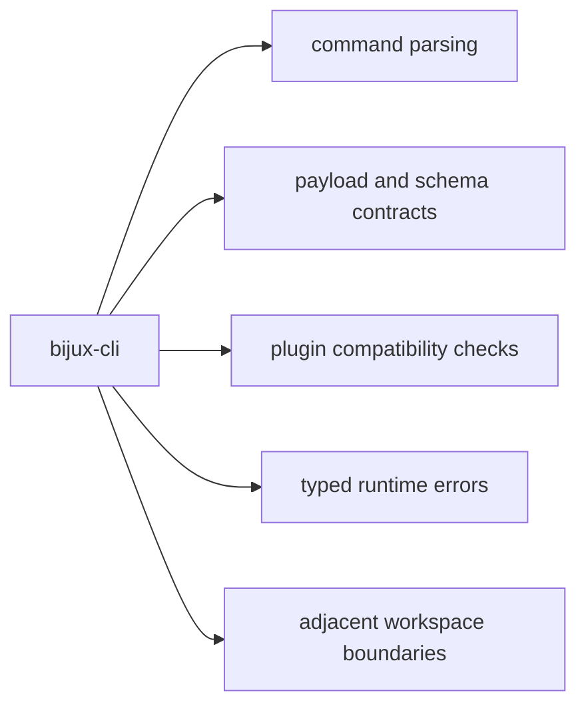

# Dependencies and Adjacencies

This page explains which dependencies shape CLI behavior and which neighboring
surfaces the CLI should leave alone.

Most dependency churn is ordinary. The pages that matter are the ones where a
dependency can change command grammar, payload shape, or plugin compatibility.

## Dependency Map

## Runtime Dependencies with Contract Pressure

- `clap`: defines command grammar and help/usage behavior
- `serde` and `serde_json`: define payload and contract serialization behavior
- `schemars`: emits schema assets for envelope and manifest contracts
- `semver`: validates plugin compatibility ranges against host versions
- `thiserror` and `anyhow`: shape internal/runtime-facing errors

## Adjacent Package Boundaries

- DAG runtime behavior and proofs stay in `bijux-dag`
- repository-level governance and docs topology stay in `bijux-core`
- maintainer automation and gate orchestration stay in `bijux-dev`

## Code Anchors

- `crates/bijux-cli/Cargo.toml`
- `crates/bijux-cli/src/contracts/schema.rs`
- `crates/bijux-cli/src/contracts/plugin.rs`
- `crates/bijux-cli/src/interface/cli/dispatch/help.rs`

## Dependency Review Rule

Any dependency update that changes parser grammar, payload encoding, schema
shape, or semver comparison behavior requires targeted tests and handbook updates
in the same pull request.

## Reading Rule

Use this page when a dependency bump or a new crate looks harmless at first but
may shift command behavior, output contracts, or the line between the CLI and
the rest of the workspace.

## Next Reads

- [Dependency Direction](../architecture/dependency-direction.md)
- [Dependency Governance](../quality/dependency-governance.md)
- [Compatibility Commitments](../interfaces/compatibility-commitments.md)
