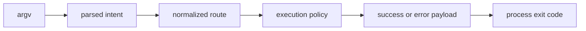

# Domain Language

This page explains the handful of CLI terms that appear across source, tests,
and public behavior.

If these words stay precise, command review stays faster and interface changes
are easier to judge without reading every implementation detail.

## Language Path

## Core Terms

- `command path`: ordered route segments such as `cli plugins install`
- `normalized path`: canonical route after alias rewriting
- `global flags`: top-level options (format, color, log-level, quiet, config-path)
- `execution policy`: resolved runtime policy used by rendering and execution
- `route target`: selected owner (`BuiltIn` or `Plugin(namespace)`)
- `envelope`: typed success/error contract structures in
  `crates/bijux-cli/src/contracts/envelope.rs`

## Plugin Terms

- `namespace`: top-level plugin route root
- `reserved namespace`: blocked names owned by built-ins or known product tools
- `compatibility range`: semver bounds a plugin declares for host runtime support
- `lifecycle state`: discovered, validated, installed, enabled, disabled, broken, incompatible

## Code Anchors

- `crates/bijux-cli/src/contracts/command.rs`
- `crates/bijux-cli/src/contracts/execution.rs`
- `crates/bijux-cli/src/contracts/plugin.rs`
- `crates/bijux-cli/src/routing/registry.rs`

## Rule for Documentation and Review

When adding new runtime behavior, prefer existing terminology. If new terms are
necessary, define them here and reflect them in contracts and tests in the same
change set.

## Reading Rule

Use this page when a CLI discussion keeps switching between commands, routes,
policies, payloads, and plugins and the boundary between those terms starts to
blur.

## Next Reads

- [Lifecycle Overview](lifecycle-overview.md)
- [Data Contracts](../interfaces/data-contracts.md)
- [Invariants](../quality/invariants.md)
