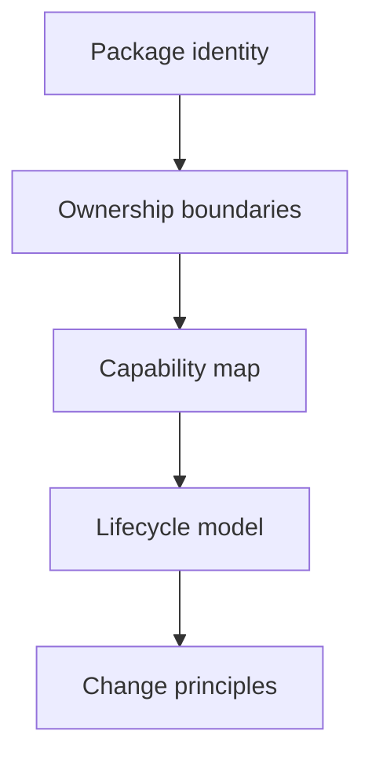

# Foundation

The foundation section answers first-order questions about `bijux-cli` ownership:
what it is, what it is not, where it fits in `bijux-core`, and which principles
keep command behavior stable as the repository evolves.

## Visual Summary

## What This Section Covers

- package role and runtime responsibility
- explicit non-goals and boundary limits
- repository fit and adjacency to DAG and dev tooling
- shared domain language used across source, tests, and docs
- lifecycle and change rules that reduce command-surface drift

## Primary Code Anchors

- `crates/bijux-cli/src/lib.rs`
- `crates/bijux-cli/src/api/mod.rs`
- `crates/bijux-cli/src/contracts/mod.rs`
- `crates/bijux-cli/src/routing/model.rs`
- `crates/bijux-cli/tests/architecture/`

## Pages In This Section

- [Package Overview](package-overview.md)
- [Scope and Non-Goals](scope-and-non-goals.md)
- [Ownership Boundary](ownership-boundary.md)
- [Repository Fit](repository-fit.md)
- [Capability Map](capability-map.md)
- [Domain Language](domain-language.md)
- [Lifecycle Overview](lifecycle-overview.md)
- [Dependencies and Adjacencies](dependencies-and-adjacencies.md)
- [Change Principles](change-principles.md)
