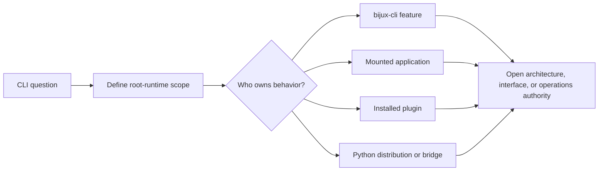

# CLI Foundation

The foundation section answers the first questions about `bijux-cli`: what it
is, what it is not, where it fits in `bijux-core`, and which principles keep
command behavior stable as the repository evolves.

The foundation section prevents root-runtime convenience from absorbing
product, plugin, Python packaging, or maintainer responsibilities.

## What This Section Covers

- package role and runtime responsibility
- explicit non-goals and boundary limits
- repository fit and adjacency to DAG and dev tooling
- shared domain language used across source, tests, and docs
- lifecycle and change rules that reduce command-surface drift

## Boundary Decisions

| Question | Read | Expected decision |
| --- | --- | --- |
| what belongs to the root command? | [Scope And Boundaries](scope-and-boundaries.md) | uniform runtime concern or delegated product behavior |
| which package owns it? | [Ownership Boundary](ownership-boundary.md) | native runtime, Python distribution, mounted app, plugin, or maintainer surface |
| what ships today? | [Capability Map](capability-map.md) | implemented, limited, or explicitly unsupported capability |
| which names are canonical? | [Domain Language](domain-language.md) | one durable term across source, help, schemas, and docs |
| what can the runtime depend on? | [Dependencies And Adjacencies](dependencies-and-adjacencies.md) | justified dependency and effect boundary |
| how should a behavior change? | [Change Principles](change-principles.md) | owner, contract, compatibility, tests, and documentation |

## Non-Inferences

- A namespace appearing in source does not prove the application is installed.
- A plugin manifest passing validation does not make plugin code sandboxed.
- Python packaging does not create a second command contract.
- An internal query API does not become an operator command automatically.
- A maintainer diagnostic observing runtime state does not own that state.

## Primary Code Anchors

- `crates/bijux-cli/src/lib.rs`
- `crates/bijux-cli/src/api/mod.rs`
- `crates/bijux-cli/src/contracts/mod.rs`
- `crates/bijux-cli/src/routing/model.rs`
- `crates/bijux-cli/tests/architecture/`

## Pages In This Section

- [Package Overview](package-overview.md)
- [Scope and Boundaries](scope-and-boundaries.md)
- [Ownership Boundary](ownership-boundary.md)
- [Repository Fit](repository-fit.md)
- [Capability Map](capability-map.md)
- [Domain Language](domain-language.md)
- [Lifecycle Overview](lifecycle-overview.md)
- [Dependencies and Adjacencies](dependencies-and-adjacencies.md)
- [Change Principles](change-principles.md)

## Reading Rule

Start here when the command surface itself is still unclear. Move to
Architecture or Interfaces once the package role and boundaries already make
sense.
