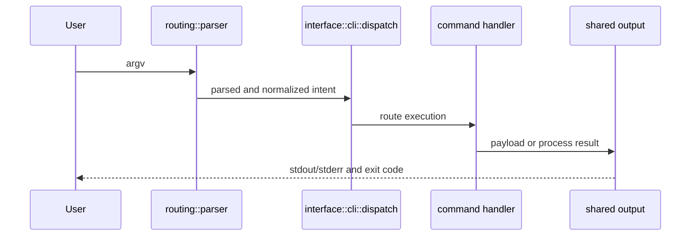

# Lifecycle Overview

A `bijux` run follows one deterministic lifecycle from argv intake to stream
emission. Understanding this lifecycle is the fastest way to debug behavior and
review compatibility impact.

## Visual Summary

## Lifecycle Stages

1. Decode OS argv and reject invalid UTF-8 input with usage-class failure.
2. Normalize global flags and route path using the clap parser model.
3. Resolve special fast paths such as help/version and known-tool delegation.
4. Execute the matched built-in or plugin route.
5. Render payload according to resolved output policy.
6. Emit streams and finalize the exit code.

## Code Anchors

- `crates/bijux-cli/src/bootstrap/wiring.rs`
- `crates/bijux-cli/src/bootstrap/run.rs`
- `crates/bijux-cli/src/routing/parser.rs`
- `crates/bijux-cli/src/interface/cli/dispatch.rs`
- `crates/bijux-cli/src/interface/cli/dispatch/route_exec.rs`

## Lifecycle Guarantees

- one normalized intent per invocation
- one route decision before handler execution
- one final exit code surfaced to the process host
- help and usage failures use explicit short-circuit paths

## Next Reads

- [Execution Model](../architecture/execution-model.md)
- [Operator Workflows](../interfaces/operator-workflows.md)
- [Failure Recovery](../operations/failure-recovery.md)
