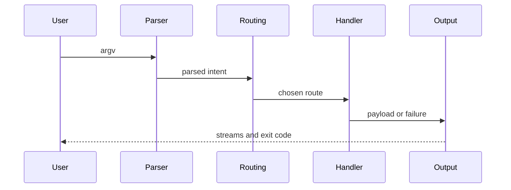

# Lifecycle Overview

This page explains the shortest path a CLI invocation takes from argv to exit
code.

That lifecycle is useful because most CLI surprises happen at one of a few
handoff points: parsing, route resolution, handler execution, or output shaping.

## Lifecycle Flow

## Lifecycle Stages

1. Decode OS argv and reject invalid UTF-8 input with usage-class failure.
2. Normalize global flags and route path using the clap parser model.
3. Resolve special fast paths such as help/version and known-tool delegation.
4. Execute the matched built-in or plugin route.
5. Render payload according to resolved output policy.
6. Emit streams and finalize the exit code.

## Code Anchors

- `crates/bijux-cli/src/bootstrap/wiring.rs`
- `crates/bijux-cli/src/bootstrap/run.rs`
- `crates/bijux-cli/src/routing/parser.rs`
- `crates/bijux-cli/src/interface/cli/dispatch.rs`
- `crates/bijux-cli/src/interface/cli/dispatch/route_exec.rs`

## Lifecycle Guarantees

- one normalized intent per invocation
- one route decision before handler execution
- one final exit code surfaced to the process host
- help and usage failures use explicit short-circuit paths

## Executable Contracts

- `crates/bijux-cli/tests/routing/parser/parser_intent.rs` checks intent and
  global-flag normalization.
- `crates/bijux-cli/tests/routing/laws/route_law_consistency.rs` checks route
  selection against the command registry.
- `crates/bijux-cli/tests/integration/cli/root/bin_core_integration.rs` checks
  startup, stream, usage, and exit behavior at the process boundary.

## Reading Rule

Use this page when a CLI behavior feels wrong but it is not yet clear whether
the problem belongs to parsing, routing, handler logic, or output formatting.

## Next Reads

- [Execution Model](../architecture/execution-model.md)
- [Operator Workflows](../interfaces/operator-workflows.md)
- [Failure Recovery](../operations/failure-recovery.md)
