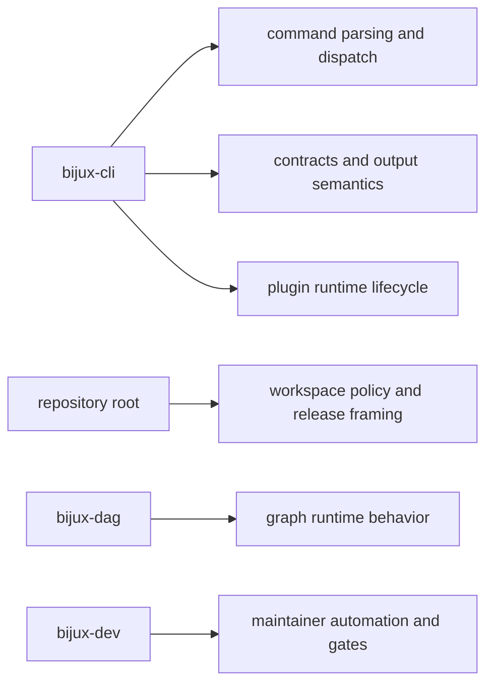

# Ownership Boundary

`bijux-cli` owns runtime command behavior, but it is not the owner of every
cross-repository concern. This boundary keeps documentation and implementation
clean across `bijux-core`, `bijux-dag`, and maintainer tooling.

## Visual Summary

## `bijux-cli` Owns

- `crates/bijux-cli/src/interface/` command and REPL interaction layers
- `crates/bijux-cli/src/routing/` parser, route catalog, and registry logic
- `crates/bijux-cli/src/contracts/` typed CLI-facing contracts
- `crates/bijux-cli/src/features/` stateful runtime features (config, plugins, history)

## `bijux-cli` Does Not Own

- DAG execution semantics implemented in DAG crates
- repository-level release governance beyond CLI package concerns
- maintainer-only gates and dev orchestration behavior in `bijux-dev`
- product websites or publication pipelines outside CLI handbook scope

## Boundary Tests

- architecture boundary checks under `crates/bijux-cli/tests/architecture/boundaries/`
- route and parser contract checks under `crates/bijux-cli/tests/routing/`
- integration suites under `crates/bijux-cli/tests/integration/`

## Boundary Rule

When a change crosses package boundaries, split the change so each package
retains its own contract authority and documentation page ownership. Shared
claims belong in repository docs, not hidden in one package handbook.

## Next Reads

- [Repository Fit](repository-fit.md)
- [Integration Seams](../architecture/integration-seams.md)
- [Review Checklist](../quality/review-checklist.md)
