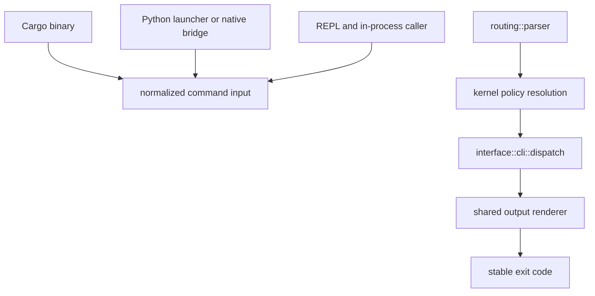

# Package Overview

`bijux-cli` is the native runtime package behind the `bijux` executable. It is
where the root command stops being a brand and becomes actual command behavior:
argv parsing, routing, runtime policy, handler execution, output rendering, and
exit mapping.

## Runtime Boundary

`bijux-cli-python` owns packaging, bridge conversion, and Python-facing
fallback behavior. It does not own a competing parser, route catalog, or output
schema. Runtime behavior changes belong in `bijux-cli`; distribution-specific
failures belong in `bijux-cli-python`.

## What This Package Owns

- canonical command parsing and path normalization
- the built-in route catalog and alias rewrites
- CLI handler execution and REPL entry integration
- structured output rendering for `json`, `yaml`, and `text`
- command, envelope, diagnostics, plugin, and config contracts used by the
  runtime

## Ownership Decisions

| Question | Owner | Reason |
| --- | --- | --- |
| how argv becomes a normalized route | `bijux-cli` routing | one parser model must serve help, CLI, and REPL behavior |
| how a built-in command behaves | `bijux-cli` feature and handler modules | command semantics are runtime behavior |
| how results become text, JSON, YAML, and exit status | `bijux-cli` contracts and shared output | every distribution must preserve one envelope contract |
| how the wheel locates or invokes runtime behavior | `bijux-cli-python` | executable and native-bridge resolution are distribution concerns |
| how Python values and failures map across the bridge | `bijux-cli-python` | conversion must remain explicit without redefining core semantics |
| how DAG workflows execute | DAG package family | `bijux` does not embed the DAG engine |
| how repository evidence is generated | `bijux-dev` | proof tooling must remain outside product runtime |

## Ownership Signals

The defect belongs to `bijux-cli` when it changes:

- command parsing, path normalization, or canonical route selection
- built-in behavior, runtime policy, or handler execution
- help text, output envelopes, stream selection, or exit mapping
- public runtime contracts or the modules that own them

## Behavior To Expect

- `bijux --help` and `bijux help ...` come from the same parser model
- unknown commands surface as usage failures with correction hints
- `--quiet` changes stream emission, not exit semantics
- structured output formatting does not change payload meaning

## Change Boundary

When a runtime change affects parser models, command envelopes, global policy,
or persisted state, verify both native behavior and Python distribution parity.
When only wheel metadata or Python conversion changes, keep the Rust command
contract fixed and prove the distribution boundary directly.

Do not add behavior to the Python fallback simply because the bridge cannot
reach it. A parity gap is a defect to classify and repair, not permission to
create two product definitions.

## Code Anchors

- `crates/bijux-cli/src/bin/bijux.rs`
- `crates/bijux-cli/src/bootstrap/run.rs`
- `crates/bijux-cli/src/interface/cli/dispatch.rs`
- `crates/bijux-cli/src/routing/parser.rs`
- `crates/bijux-cli/src/contracts/`

## Authorities

- [CLI Surface](../interfaces/cli-surface.md) for the user-visible command contract
- [Execution Model](../architecture/execution-model.md) for runtime assembly
- [Package Index](../packages/index.md) when the question might still belong to
  `bijux-cli-python` instead
- [Python Package](../packages/bijux-cli-python.md) for packaging and bridge
  ownership
