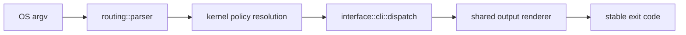

# Package Overview

`bijux-cli` is the canonical runtime behind the `bijux` binary. It receives argv,
normalizes command intent, resolves runtime policy, dispatches handlers, renders
payloads, and emits the final process exit code.

## Visual Summary

## Owned Surface

- canonical command parsing and path normalization
- built-in route catalog and alias rewrites
- CLI handler execution and REPL entry integration
- structured output rendering for `json`, `yaml`, and `text`
- contract structs for commands, envelopes, diagnostics, plugins, and config

## Code Anchors

- `crates/bijux-cli/src/bin/bijux.rs`
- `crates/bijux-cli/src/bootstrap/run.rs`
- `crates/bijux-cli/src/interface/cli/dispatch.rs`
- `crates/bijux-cli/src/routing/parser.rs`
- `crates/bijux-cli/src/contracts/`

## Public Behavior Anchor Points

- `bijux --help` and `bijux help ...` are generated from the same parser model
- unknown commands are surfaced as usage failures with correction hints
- `--quiet` suppresses stdout/stderr content while preserving exit semantics
- structured output formatting does not alter payload meaning

## Questions This Page Answers

- what runtime path every command invocation goes through
- where CLI behavior ownership starts and ends in the repository
- which modules define contract-bearing behavior versus helper internals

## Next Reads

- [Scope and Non-Goals](scope-and-non-goals.md)
- [Execution Model](../architecture/execution-model.md)
- [CLI Surface](../interfaces/cli-surface.md)
