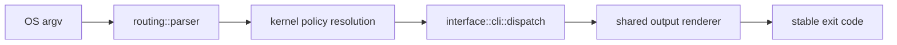

# Package Overview

`bijux-cli` is the native runtime package behind the `bijux` executable. It is
where the root command stops being a brand and becomes actual command behavior:
argv parsing, routing, runtime policy, handler execution, output rendering, and
exit mapping.

Use this page when you already know the question belongs to the CLI runtime and
you need the package boundary before reading code.

## Visual Summary

## What This Package Owns

- canonical command parsing and path normalization
- the built-in route catalog and alias rewrites
- CLI handler execution and REPL entry integration
- structured output rendering for `json`, `yaml`, and `text`
- command, envelope, diagnostics, plugin, and config contracts used by the
  runtime

## Reader Shortcut

If the problem starts with one of these questions, you are in the right place:

- Why did `bijux` parse or route this command the way it did?
- Which package owns root command behavior rather than Python packaging?
- Where do help text, output envelopes, and exit behavior become concrete?
- Which modules define contract-bearing runtime behavior rather than helper
  internals?

## Behavior To Expect

- `bijux --help` and `bijux help ...` come from the same parser model
- unknown commands surface as usage failures with correction hints
- `--quiet` changes stream emission, not exit semantics
- structured output formatting does not change payload meaning

## Code Anchors

- `crates/bijux-cli/src/bin/bijux.rs`
- `crates/bijux-cli/src/bootstrap/run.rs`
- `crates/bijux-cli/src/interface/cli/dispatch.rs`
- `crates/bijux-cli/src/routing/parser.rs`
- `crates/bijux-cli/src/contracts/`

## Read Next

- [CLI Surface](../interfaces/cli-surface.md) for the user-visible command contract
- [Execution Model](../architecture/execution-model.md) for runtime assembly
- [Package Index](../packages/index.md) when the question might still belong to
  `bijux-cli-python` instead
