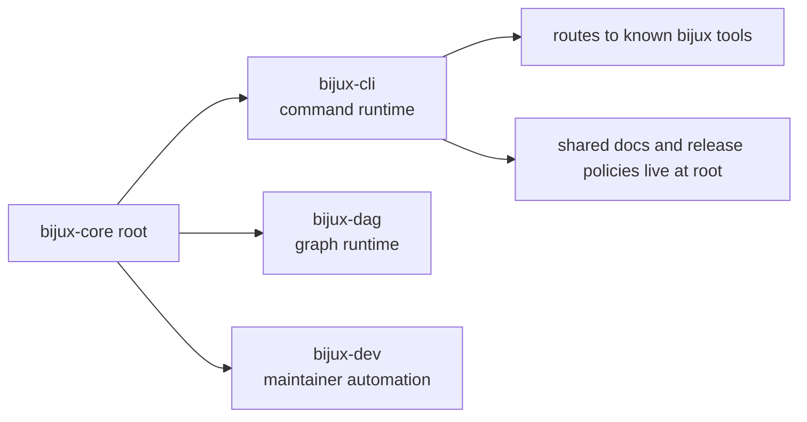

# Repository Fit

`bijux-cli` is one package in `bijux-core`, not the whole platform. This page
explains where the CLI handbook should stop, and where repository-level,
DAG-level, or maintainer-only documentation should take over.

## Visual Summary

## Why This Boundary Matters

- prevents CLI docs from drifting into DAG behavior claims
- keeps maintainer controls in `bijux-dev` rather than user-facing pages
- makes cross-package reviews explicit when command routing reaches other tools

## Code Anchors

- `crates/bijux-cli/src/contracts/product_mount.rs`
- `crates/bijux-cli/src/routing/registry.rs`
- `crates/bijux-cli/src/interface/cli/dispatch/delegation.rs`
- `contracts/official_product_namespace_registry.json`

## Integration Rules

- CLI pages describe `bijux` runtime behavior and contracts only
- DAG semantics are documented in the DAG handbook
- maintainer workflows and CI orchestration are documented in the dev handbook
- root docs own cross-package scope, layout, and publication rules

## Questions This Page Answers

- where CLI authority begins and ends in the merged repository
- how adjacent product namespaces are recognized and protected
- why route delegation is documented as integration, not ownership transfer

## Next Reads

- [Dependencies and Adjacencies](dependencies-and-adjacencies.md)
- [Integration Seams](../architecture/integration-seams.md)
- [Deployment Boundaries](../operations/reference/deployment-boundaries.md)
