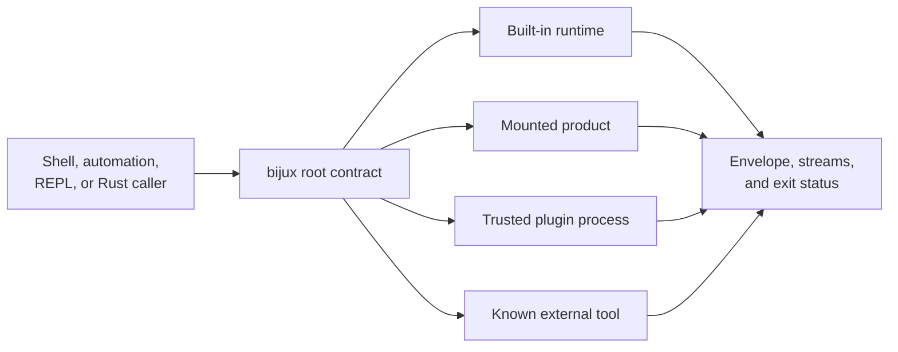

# Scope and Boundaries

`bijux` owns one root command contract across the Rust binary and Python
distribution. It normalizes intent, resolves command ownership, executes
built-ins or explicitly delegated extensions, and returns coherent payload,
stream, and exit semantics.

## Runtime Boundary

The root owns parsing and route selection for every edge. Execution authority
then changes. Built-ins remain native. Mounted products own their product
semantics. Plugins and external tools execute code outside the built-in trust
boundary.

## Supported Responsibilities

| Responsibility | Supported boundary |
| --- | --- |
| command grammar | deterministic parsing, normalization, aliases, help, suggestions, and usage failures |
| route ownership | built-in, official product, known-tool, app, and plugin namespaces resolved by one registry law |
| runtime policy | format, color, quiet, debug, config, and path inputs resolved before execution |
| built-in features | configuration, history, memory, plugins, apps, diagnostics, documentation, version, and REPL workflows |
| output | human, JSON, and YAML rendering with explicit stdout, stderr, and exit classification |
| persistent state | owned paths, atomic writes or rollback where promised, diagnostics, and explicit recovery |
| Rust integration | public `api`, `contracts`, and `sdk` roots |
| Python delivery | the same `bijux` root behavior through the packaged native bridge |

## Delegated Ownership

| Surface | Root CLI owns | Delegated owner retains |
| --- | --- | --- |
| mounted application | namespace, descriptor validation, invocation context, root-compatible result | domain commands and product behavior |
| plugin | manifest, namespace, compatibility, lifecycle, launcher policy | entrypoint code, dependencies, filesystem/network effects, domain output |
| known tool | discovery and explicit delegation route | executable installation, internal commands, and tool-specific contract |
| `bijux-dag` | optional command integration boundary | graph, run, replay, cache, backend, and evidence semantics |

Route integration does not merge compatibility promises. A plugin manifest can
be structurally valid while its code remains unsafe. A known tool can be
discoverable while absent from the current installation.

## Explicit Limits

- Plugins are not sandboxed and execute with the invoking user's authority.
- A stable in-process ABI is not promised for arbitrary host integration;
  downstream Rust callers use the supported public facades.
- Complete Windows host support is not part of the current release contract.
- Installing the PyPI distribution does not install every delegated product
  executable.
- Repository gates, evidence generation, and release governance belong to
  `bijux-dev`, not the public runtime.

## Contract Change Test

A change is caller-visible when it alters any of these:

- accepted argv or normalized command identity;
- route precedence, namespace refusal, help, or suggestions;
- effective configuration or state location;
- public Rust imports or serialized contracts;
- human or machine payload meaning;
- stdout/stderr placement or exit classification;
- plugin/app lifecycle or delegated process policy.

Such changes require compatibility review, focused contract proof, reader
guidance, and release notes where consumer action is needed. Internal movement
behind a stable facade may remain implementation detail.

## Ownership Anchors

- `crates/bijux-cli/src/routing/model.rs`
- `crates/bijux-cli/src/routing/registry.rs`
- `crates/bijux-cli/src/features/plugins/`
- `crates/bijux-cli/src/interface/cli/dispatch/policy.rs`
- `crates/bijux-cli/src/kernel/`
- `contracts/foundation/cli_dependency_direction.v1.json`
- `contracts/foundation/workspace_product_map.v1.json`

## Continue Reading

- [Ownership Boundary](ownership-boundary.md)
- [Capability Map](capability-map.md)
- [Compatibility Commitments](../interfaces/compatibility-commitments.md)
- [Security and Safety](../operations/security-and-safety.md)
- [Known Limitations](../quality/known-limitations.md)
