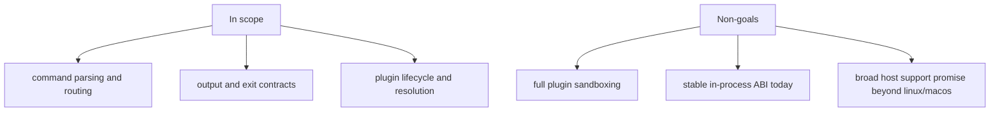

# Scope and Non-Goals

This page makes the CLI contract explicit by separating what `bijux-cli` must
defend from what it intentionally does not promise.

## Visual Summary

## In Scope

- deterministic parsing and normalization of command paths
- runtime policy resolution from flags, config, and defaults
- built-in command execution (`status`, `audit`, `docs`, `config`, `plugins`, and more)
- plugin discovery, manifest checks, route registration, and lifecycle toggles
- stable error shaping for usage, validation, and internal runtime failures

## Non-Goals

- treating plugin execution as a hardened security sandbox
- promising a stable in-process extension ABI at current maturity
- collapsing all repository behavior into the root handbook
- claiming Windows host support as a complete product contract

## Code Anchors

- `crates/bijux-cli/src/routing/model.rs`
- `crates/bijux-cli/src/routing/registry.rs`
- `crates/bijux-cli/src/features/plugins/`
- `crates/bijux-cli/src/interface/cli/dispatch/policy.rs`
- `crates/bijux-cli/src/kernel/`

## Working Rule

If behavior affects command compatibility, route identity, output payload shape,
or exit semantics, it belongs in scope and must be reviewed as a contract
change. If it is internal convenience with no external contract effect, it
belongs in implementation detail.

## Next Reads

- [Ownership Boundary](ownership-boundary.md)
- [Compatibility Commitments](../interfaces/compatibility-commitments.md)
- [Known Limitations](../quality/known-limitations.md)
