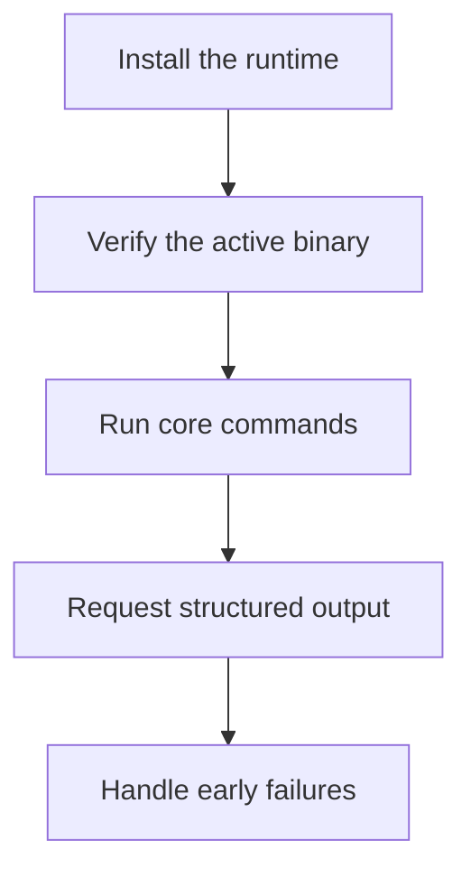
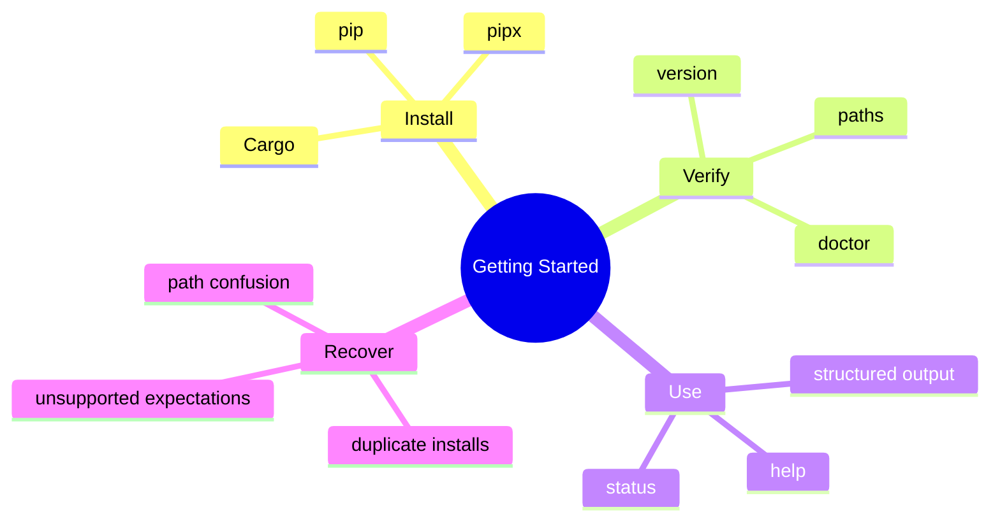

# Getting Started

## Purpose

This section is the practical onboarding path after the introduction pages. It
shows how to get a working installation, verify it, run a few real commands,
and avoid the most common early misunderstandings.

This flowchart is the practical onboarding path for new users. It shows the
order that prevents confusion: install first, verify the active binary, prove a
few commands work, then move to structured output and troubleshooting.

The mindmap highlights the themes behind that path: one install choice, early
verification, a small set of first commands, and explicit recovery steps when
expectations or environment state are wrong.

## Read This Set In Order

1. [Install And Verify](install-and-verify.md)
2. [Installation And Recovery](installation-and-recovery.md)
3. [Run Your First Commands](run-your-first-commands.md)
4. [Use Structured Output](use-structured-output.md)
5. [Troubleshoot Early Problems](troubleshoot-early-problems.md)

## Scope

These pages are intentionally narrow:

- they cover the first successful operational path
- they do not replace the full installation or command references
- they avoid feature tours that belong in guides or architecture

## Next Step

If you have not read the project identity and limits yet, start with
[Introduction](../introduction/index.md). If you already know what Bijux is,
continue to [Install And Verify](install-and-verify.md).
