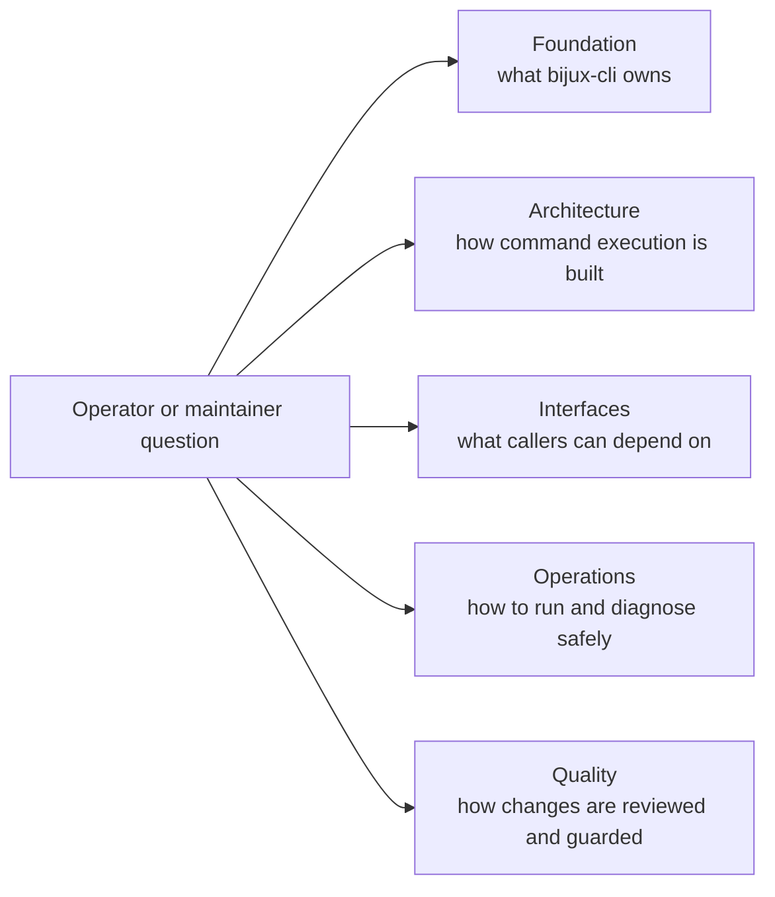

# CLI Handbook

`bijux-cli` is the operator-facing runtime for the `bijux` command surface. It
owns command normalization, runtime policy resolution, route execution,
structured output, exit behavior, and plugin routing boundaries for the workspace.

This handbook is written for two outcomes:

- a reader can find the right page without reading the whole repository
- a reviewer can trace each claim to concrete `crates/bijux-cli` code

## Visual Summary

## Handbook Structure Contract

`docs/bijux-cli/` remains intentionally stable:

- exactly five top-level section directories: `foundation`, `architecture`,
  `interfaces`, `operations`, `quality`
- each section contains exactly ten pages
- no nested section trees under `docs/bijux-cli/`

This shape is enforced so long-lived links and review checklists do not drift.

## Code Anchors

- `crates/bijux-cli/src/bin/bijux.rs`
- `crates/bijux-cli/src/bootstrap/run.rs`
- `crates/bijux-cli/src/interface/cli/dispatch.rs`
- `crates/bijux-cli/src/routing/parser.rs`
- `crates/bijux-cli/src/routing/registry.rs`
- `crates/bijux-cli/src/contracts/`

## Use This Handbook When

- the question is about `bijux` command behavior, flags, output, or exit codes
- plugin lifecycle, route ownership, or route conflicts are in scope
- CLI and REPL behavior must stay aligned
- a documentation claim needs to be verified against source and tests

## Main Paths

- [Foundation](foundation/index.md)
- [Architecture](architecture/index.md)
- [Interfaces](interfaces/index.md)
- [Operations](operations/index.md)
- [Quality](quality/index.md)

## Related Handbooks

- [Repository Handbook](../bijux-core/index.md)
- [DAG Handbook](../bijux-dag/index.md)
- [Maintainer Handbook](../bijux-dev/index.md)
