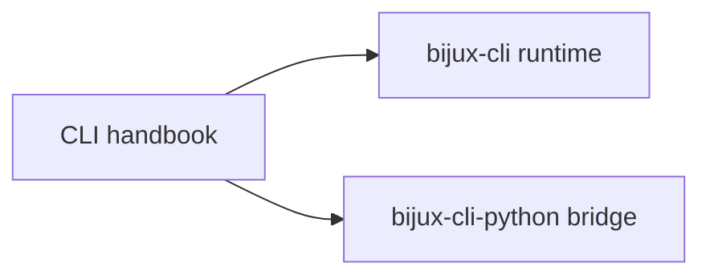

# CLI Handbook

`bijux-cli` is the operator-facing runtime for the `bijux` command surface. It
owns command normalization, runtime policy resolution, route execution,
structured output, exit behavior, and plugin routing boundaries.

Use this handbook when the question is about command behavior, route ownership,
plugin boundaries, REPL behavior, or the Python bridge that distributes the
same runtime.

<a class="md-button md-button--primary" href="packages/bijux-cli.md">Open the runtime package</a>
<a class="md-button" href="packages/bijux-cli-python.md">Open the Python bridge package</a>

## Package Map

## Package Destinations

- [`bijux-cli`](packages/bijux-cli.md) owns native runtime semantics
- [`bijux-cli-python`](packages/bijux-cli-python.md) owns Python packaging
  and bridge compatibility
- stay in this handbook when the question spans both CLI packages

## Code Anchors

- `crates/bijux-cli/src/bin/bijux.rs`
- `crates/bijux-cli/src/bootstrap/run.rs`
- `crates/bijux-cli/src/interface/cli/dispatch.rs`
- `crates/bijux-cli/src/routing/parser.rs`
- `crates/bijux-cli/src/routing/registry.rs`
- `crates/bijux-cli/src/contracts/`

## Read This Handbook When

- the question is about `bijux` command behavior, flags, output, or exit codes
- plugin lifecycle, route ownership, or route conflicts are in scope
- CLI and REPL behavior must stay aligned
- a documentation claim needs to be verified against source and tests

## Main Paths

- [Foundation](foundation/index.md)
- [Architecture](architecture/index.md)
- [Interfaces](interfaces/index.md)
- [Operations](operations/index.md)
- [Quality](quality/index.md)

## Related Handbooks

- [Repository Handbook](../bijux-core/index.md)
- [DAG Handbook](../bijux-dag/index.md)
- [Maintainer Handbook](../bijux-dev/index.md)
