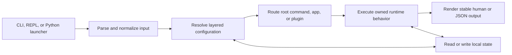

# CLI Handbook

`bijux` is the root command runtime for the wider Bijux tool ecosystem. One
process contract governs built-in commands, mounted products, plugins, layered
configuration, local state, the REPL, and structured output. That common
contract lets operators move between interactive use and automation without
learning a different failure or output model.

Use this handbook when the question is about what `bijux` does at the command
line, how it behaves under automation, or how the Python distribution reaches
the same runtime contract.

<a class="md-button md-button--primary" href="packages/bijux-cli.md">Open the runtime package</a>
<a class="md-button" href="packages/bijux-cli-python.md">Open the Python bridge package</a>

## What `bijux` Covers Today

The visible `bijux --help` surface currently groups into four kinds of work:

- runtime and diagnostics: `status`, `audit`, `docs`, `doctor`, `version`,
  `install`, `explain`
- app routing: `apps`
- configuration and extension points: `config`, `plugins`
- interaction and local state: `repl`, `completion`, `history`, `memory`

Official apps such as `atlas`, `dag`, `dna`, `gnss`, `rag`, `rar`, and `vex`
mount through this runtime rather than defining their own root command
contract.

Every entry path converges on the same native runtime contract. The Python
package owns distribution and process launching; it does not define a second
parser, router, state model, or output schema.

## Operator Contract At A Glance

| Boundary | What `bijux` decides | What remains authoritative |
| --- | --- | --- |
| invocation | argument decoding, interactive entry, global flags | operating-system argv and terminal context |
| routing | aliases, canonical command identity, built-in versus delegated ownership | registered route and plugin lifecycle state |
| configuration | layer order, provenance, validation, and display redaction | the selected value and its source |
| execution | handler ordering, stream placement, and exit classification | delegated process streams and exit code when delegation occurs |
| local state | schema, bounded reads, atomic persistence, and recovery behavior | the state file selected by the active configuration |
| diagnostics | stable statuses, reason codes, and machine-readable payloads | underlying filesystem, process, compatibility, and integrity facts |

`bijux` can validate whether an extension may be routed. It cannot establish
that third-party code is trustworthy, and it does not sandbox that code from
the current user account.

## Start Here

| If you want to... | Open this page |
| --- | --- |
| understand what `bijux` promises at the command line | [Interfaces](interfaces/index.md) |
| understand how the runtime is assembled | [Architecture](architecture/index.md) |
| install, diagnose, or operate the CLI locally | [Operations](operations/index.md) |
| understand package roles and product scope | [Foundation](foundation/index.md) |
| review test-backed limits, invariants, and acceptance standards | [Quality](quality/index.md) |

## Package Split

- [`bijux-cli`](packages/bijux-cli.md) owns native runtime semantics,
  routing, execution flow, and output behavior
- [`bijux-cli-python`](packages/bijux-cli-python.md) owns Python packaging,
  launcher behavior, and bridge compatibility

Stay in this handbook when the question spans both packages or when the right
owner is not obvious yet.

## First Diagnostic Path

1. Capture `bijux status --format json --no-pretty` and
   `bijux doctor --format json --no-pretty`.
2. If routing is involved, compare the requested route with the canonical
   route in structured diagnostics.
3. If a plugin is involved, inspect its record and run
   `bijux plugins doctor --format json --no-pretty` before changing files.
4. If configuration is involved, use the
   [Configuration Guide](interfaces/config-guide.md) to identify the winning
   layer without exposing secret values.
5. Preserve stderr, stdout, and the exit status as separate evidence. Merging
   them discards the distinction between result data and diagnostics.

The [Diagnostics Guide](operations/diagnostics-guide.md) expands this path;
the [CLI Surface](interfaces/cli-surface.md) defines command ownership and
aliases.

## When To Leave This Handbook

- Move to the [Repository Handbook](../bijux-core/index.md) when the answer
  depends on shared release rules or cross-product ownership.
- Move to the [DAG Handbook](../bijux-dag/index.md) when the question is about
  graph execution or the `bijux-dag` surface rather than the root runtime.
- Move to the [Maintainer Handbook](../bijux-dev/index.md) when the question
  is about repository gates, documentation generation, or release proof.
