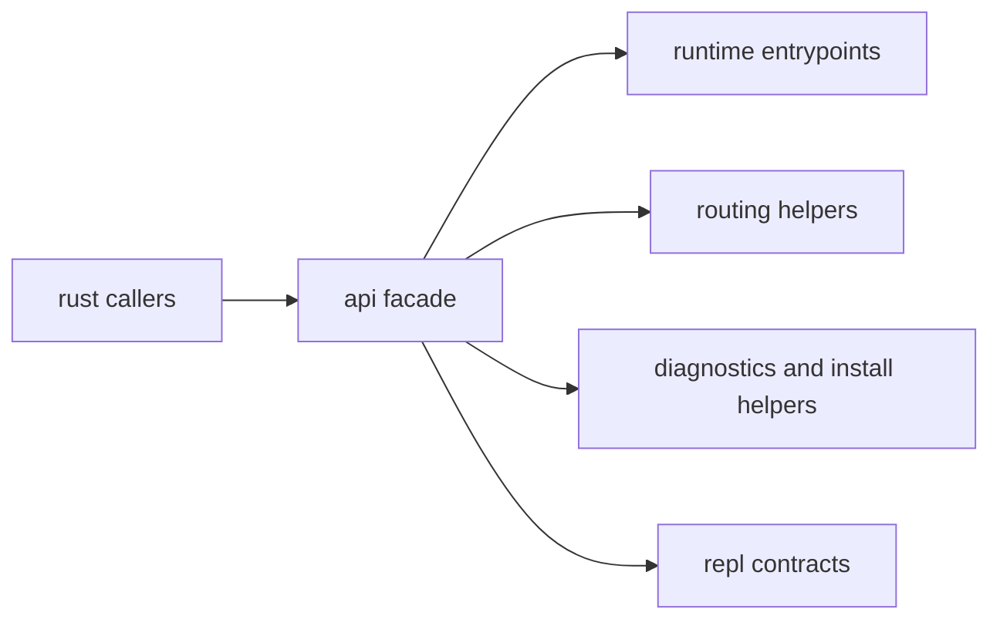

# API Surface

This page explains the Rust-facing entrypoints that matter when code wants CLI
behavior without depending on internal modules.

The public surface is small on purpose: call through the facade, not through
deep implementation paths.

## API Map

## Public API Modules

- runtime: process execution entrypoints
- parser/routing: clap intent parsing and route helpers
- output: renderer and emission helpers
- diagnostics: state and route inventory queries
- install/plugins/version/telemetry: runtime integration utilities
- repl: interactive execution contracts and utilities

## Code Anchors

- `crates/bijux-cli/src/api/mod.rs`
- `crates/bijux-cli/src/api/runtime.rs`
- `crates/bijux-cli/src/api/routing.rs`
- `crates/bijux-cli/src/api/repl.rs`
- `crates/bijux-cli/src/api/diagnostics.rs`

## API Surface Rules

- prefer importing from `api` modules over internal implementation paths
- API facades should stay thin and explicit about ownership boundaries
- when facade exports change, update this page and public import guidance

## Reading Rule

Use this page when Rust code needs CLI behavior and the real question is which
facade module owns the call.

## Next Reads

- [Public Imports](public-imports.md)
- [Data Contracts](data-contracts.md)
- [Code Navigation](../architecture/code-navigation.md)
