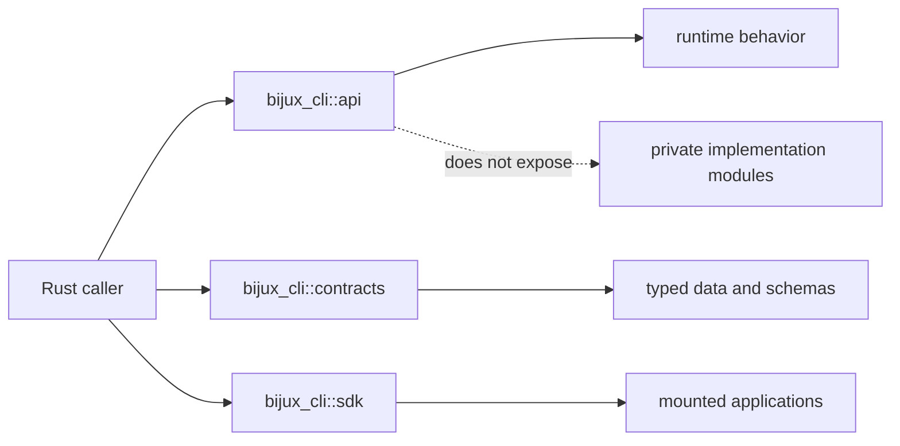

# API Surface

The `bijux_cli::api` tree is the supported facade for invoking and inspecting
root CLI behavior from Rust. It re-exports selected implementation functions;
it does not transfer ownership of domain logic into the facade.

## Facade Inventory

| Module | Use it for | Owned behind the facade |
| --- | --- | --- |
| `config` | validate a CLI configuration file | configuration feature |
| `diagnostics` | inspect state paths, routes, and diagnostic reports | diagnostics feature |
| `install` | inspect or validate installation state | installation feature |
| `kernel` | execute through kernel policy and request types | execution kernel |
| `output` | emit root-compatible success and error output | shared renderer |
| `parser` | normalize argv into command intent | routing parser |
| `plugins` | list plugins and inspect load diagnostics | plugin feature |
| `repl` | build and run interactive sessions | REPL interface |
| `routing` | query catalogs, parsers, and route registries | routing subsystem |
| `runtime` | run the CLI from argv or the environment | bootstrap and dispatch |
| `telemetry` | emit and inspect runtime telemetry | telemetry subsystem |
| `version` | read build and runtime version identity | version subsystem |

The inventory is defined by `crates/bijux-cli/src/api/mod.rs`. A capability
that is absent from that file is not part of the runtime facade even if a
similar function exists in the repository.

## Boundary Map

`api`, `contracts`, and `sdk` can appear in the same integration, but they
answer different questions:

- call `api` to perform or inspect behavior;
- use `contracts` to exchange governed data;
- use `sdk` to implement a mounted application.

This separation matters during upgrades. A parser implementation can move
without changing `api::parser`; a payload can evolve independently through a
versioned contract; and an app can be tested through the SDK without depending
on root dispatch internals.

## Runtime Entrypoints

`api::runtime` exposes two deliberate forms:

- `run_app(&argv)` runs a supplied argument vector and returns `AppRunResult`;
- `run_cli_from_env()` reads the process invocation and drives the executable
  path.

Libraries and tests should normally supply argv to `run_app`. Executable
entrypoints own environment decoding and should use `run_cli_from_env`.
Callers remain responsible for choosing whether to render returned output,
propagate the exit code, or translate the result into another application
contract.

## Parser And Routing Queries

Use `api::parser` when the input is command text or argv and the desired result
is normalized intent. Use `api::routing` when the input is already structured
and the question concerns the command catalog, parser registry, or route
registry.

Do not bypass either facade to depend on `src/routing` paths. Those modules are
private so parser and registry internals can change while the selected query
surface remains reviewable.

## Output And Diagnostics

`api::output` reuses the installed CLI renderer. It is appropriate when an
embedding process must preserve stdout, stderr, color, pretty-printing, and
quiet-mode behavior. For mounted apps, prefer `sdk::CommandResult` and
`sdk::SdkRenderConfig`, which package those decisions into the app contract.

`api::diagnostics` exposes diagnostic reports and a nested `state_paths`
surface. A path query describes where the runtime resolved state; it does not
grant ownership of the underlying files. State mutation must still go through
the relevant command or feature contract.

## Compatibility Rules

- Additions to `api::mod.rs` are intentional public-surface changes and require
  documentation plus targeted tests.
- Re-export changes must be reviewed for downstream source compatibility.
- Serialized compatibility belongs to `contracts`, not to an incidental
  `api` return type.
- Private implementation paths carry no downstream compatibility promise.
- Behavior, output shape, and exit classification remain subject to the
  [Compatibility Commitments](compatibility-commitments.md).

Use [Public Imports](public-imports.md) for concrete import selection and
[Data Contracts](data-contracts.md) for envelope and schema authority.

## Verification Sources

- `crates/bijux-cli/src/api/mod.rs`
- `crates/bijux-cli/src/lib.rs`
- `crates/bijux-cli/tests/routing/`
- `crates/bijux-cli/tests/integration/`
