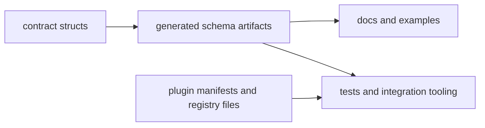

# Artifact Contracts

Artifact contracts define the files and schemas that outlive a single process
run and are consumed by tooling, reviewers, or plugin authors.

## Visual Summary

## Contract Artifacts

- JSON schema for `output_envelope_v1`
- JSON schema for `error_envelope_v1`
- JSON schema for `plugin_manifest_v2`
- plugin manifest documents in installed plugin directories
- registry and diagnostics files for plugin lifecycle state

## Code Anchors

- `crates/bijux-cli/src/contracts/schema.rs`
- `crates/bijux-cli/src/contracts/envelope.rs`
- `crates/bijux-cli/src/contracts/plugin.rs`
- `crates/bijux-cli/tests/routing/snapshots/`
- `tools/docs/publish_contract_assets.py`

## Artifact Rules

- schema shape changes require explicit compatibility review
- docs and examples must track current schema field semantics
- generated contract assets should be reproducible from source contracts
- plugin manifest requirements must stay aligned with runtime validators

## Next Reads

- [Data Contracts](data-contracts.md)
- [Documentation Standards](../quality/documentation-standards.md)
- [Release and Versioning](../operations/release-and-versioning.md)
