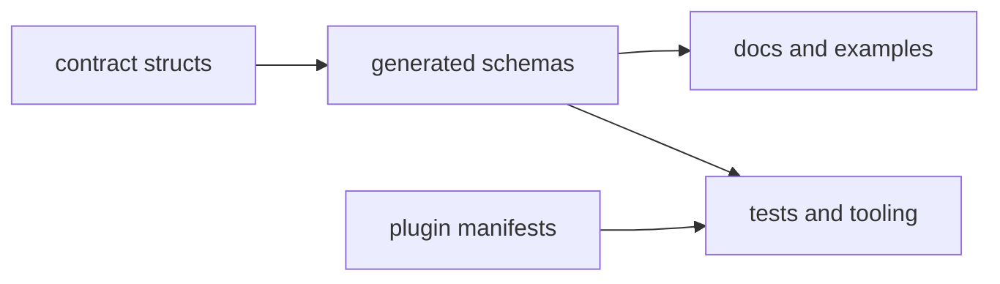

# Artifact Contracts

This page explains which CLI artifacts outlive a single process run and why
they matter.

These files become part of the review and tooling surface. That means their
shape has to stay as deliberate as the runtime behavior that produced them.

## Artifact Map

## Contract Artifacts

- JSON schema for `output_envelope_v1`
- JSON schema for `error_envelope_v1`
- JSON schema for `plugin_manifest_v2`
- plugin manifest documents in installed plugin directories
- registry and diagnostics files for plugin lifecycle state

## Code Anchors

- `crates/bijux-cli/src/contracts/schema.rs`
- `crates/bijux-cli/src/contracts/envelope.rs`
- `crates/bijux-cli/src/contracts/plugin.rs`
- `crates/bijux-cli/tests/routing/snapshots/`
- `docs/automation/publish_contract_assets.py`

## Artifact Rules

- schema shape changes require explicit compatibility review
- docs and examples must track current schema field semantics
- generated contract assets should be reproducible from source contracts
- plugin manifest requirements must stay aligned with runtime validators

## Reading Rule

Use this page when the change affects files, schemas, or manifests that another
tool or reviewer will consume after the command exits.

## Next Reads

- [Data Contracts](data-contracts.md)
- [Documentation Standards](../quality/documentation-standards.md)
- [Release and Versioning](../operations/release-and-versioning.md)
