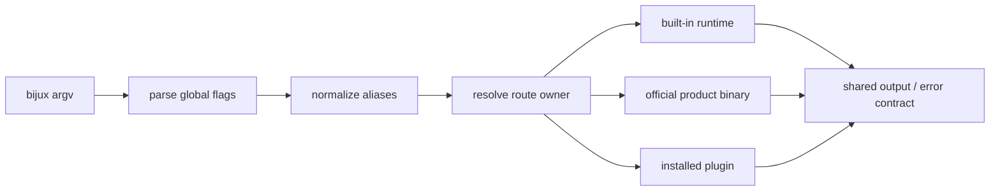

# CLI Surface

`bijux` is a routing runtime, not a single flat command list. It owns built-in
runtime and state commands, reserves official Bijux product namespaces, and
admits installed plugin namespaces only after conflict checks. Every accepted
path is normalized before dispatch so aliases do not create alternate
semantics.

## Route Ownership

| Route family | Representative paths | Owner |
| --- | --- | --- |
| runtime inspection | `status`, `audit`, `docs`, `doctor`, `version`, `explain` | `bijux-cli` |
| runtime installation | `install`, `apps list`, `apps doctor`, `apps which` | `bijux-cli` |
| CLI control | `cli status`, `cli paths`, `cli routes`, `cli shims`, `cli script-contract`, `cli self-test` | `bijux-cli` |
| configuration | `cli config get`, `set`, `diff`, `validate`, `repair`, `export`, `load` | `bijux-cli` |
| plugin lifecycle | `cli plugins list`, `inspect`, `check`, `install`, `enable`, `disable`, `uninstall`, `doctor` | `bijux-cli` |
| local state | `history`, `history clear`, `memory list`, `memory get`, `memory set`, `memory delete`, `memory clear` | `bijux-cli` |
| interaction | `repl`, `completion` | `bijux-cli` |
| official products | reserved names such as `dag` and its `workflow` alias | the product runtime named by the official registry |
| third-party extensions | a registered namespace or registered top-level alias | the installed plugin manifest |

The maintainer control plane is not a hidden route family. `bijux-dev-cli` and
product-specific maintainer binaries remain separate executables. Runtime
queries may expose read-only facts to them, but the `bijux` registry does not
assemble maintainer reports or dispatch maintainer commands.

## Canonical Paths And Aliases

The canonical built-in control paths use the `cli` prefix. Short root forms are
accepted where the routing model declares a rewrite:

| Accepted input | Canonical path |
| --- | --- |
| `bijux doctor` | `bijux cli doctor` |
| `bijux version` | `bijux cli version` |
| `bijux config get KEY` | `bijux cli config get KEY` |
| `bijux plugins inspect NAME` | `bijux cli plugins inspect NAME` |

Root commands such as `status`, `audit`, `apps`, `history`, and `memory` are
already canonical and are not mechanically moved under `cli`. Some group roots
have compatibility behavior of their own; callers that need a stable leaf
should invoke the explicit subcommand.

Alias normalization happens before route resolution. An alias therefore shares
the canonical command's handler, output schema, side effects, and exit status.
Tests compare root and prefixed forms so a convenience spelling cannot evolve
into a second implementation.

## Namespace Admission

Built-in roots, their aliases, and official product namespaces are reserved.
Plugin installation rejects a namespace or alias when it:

- normalizes to a reserved name
- collides with a built-in route root
- collides with an official product namespace or alias
- duplicates another installed plugin namespace or alias

Unknown and ambiguous routes are explicit errors. The registry does not choose
an arbitrary plugin, and a plugin cannot shadow a built-in or product command.
Use `bijux cli routes` for built-in paths and alias rewrites, `bijux apps list`
for official products, and `bijux plugins list` for installed extensions.

## Global Flags

Global flags may appear before or after a recognized command path. Product
delegation normalizes them before invoking the owned runtime.

| Flag | Accepted values | Contract |
| --- | --- | --- |
| `--format`, `-f` | `text`, `json`, `jsonl`, `yaml` | selects the output encoding |
| `--pretty`, `--no-pretty` | toggles | controls structured indentation; the later conflicting option wins |
| `--color` | `auto`, `always`, `never` | controls ANSI rendering for text |
| `--log-level` | `trace`, `debug`, `info`, `warning`, `error`, `critical` | selects diagnostic verbosity |
| `--quiet`, `-q` | toggle | suppresses successful text output only |
| `--config-path` | file path | uses an explicit configuration file |

`--json` and `--text` remain hidden compatibility aliases for
`--format json` and `--format text`. New automation should use `--format`.

## Output And Exit Discipline

Successful structured output uses `OutputEnvelopeV1` with `status`, `data`, and
`meta`. Structured failures use `ErrorEnvelopeV1` with `status`, `error`, and
`meta`. JSON Lines emits one compact JSON value per array item, or one line for
a non-array value.

Stream and suppression rules are stable:

- success is written to stdout
- failure is written to stderr
- `--quiet` does not suppress errors
- `--quiet` does not remove structured success output
- text color follows `--color` and the external no-color policy

Exit codes are independent of presentation:

| Code | Meaning |
| --- | --- |
| `0` | success |
| `1` | runtime, plugin, or internal failure |
| `2` | usage or validation failure |
| `3` | output encoding failure |
| `130` | interrupted execution |

Automation should evaluate both the exit status and the structured envelope.
Parsing a human-readable message is not a supported error-classification
strategy.

## Authorities

- route paths and alias rewrites:
  `crates/bijux-cli/src/routing/model.rs`
- parser and global flags:
  `crates/bijux-cli/src/routing/parser.rs`
- namespace conflicts and introspection:
  `crates/bijux-cli/src/routing/registry.rs`
- official product ownership:
  `contracts/official_product_namespace_registry.json`
- output rendering:
  `crates/bijux-cli/src/shared/output.rs`
- success and error schemas:
  `contracts/schemas/output-envelope-v1.schema.json` and
  `contracts/schemas/error-envelope-v1.schema.json`
- CLI golden files:
  `crates/bijux-cli/tests/data/golden/cli_surface/`

## Related Guides

- [Operator Workflows](operator-workflows.md)
- [Configuration Surface](configuration-surface.md)
- [App Integration Guide](app-integration-guide.md)
- [Entrypoints and Examples](entrypoints-and-examples.md)
- [Compatibility Commitments](compatibility-commitments.md)
