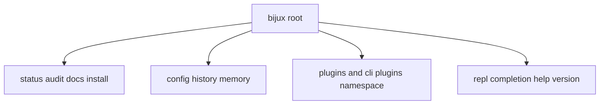

# CLI Surface

`bijux-cli` exposes a route-oriented command surface where global flags apply
across commands and aliases normalize toward canonical forms.

## Visual Summary

## Stable Route Groups

- runtime probes: `status`, `audit`, `docs`, `doctor`, `version`
- state management: `config`, `history`, `memory`
- plugin lifecycle: `plugins` and `cli plugins ...`
- interaction: `repl`, `completion`, `help`

## Global Flag Contract

- `--format|-f`: `text`, `json`, `yaml`
- `--json` and `--text`: explicit format aliases
- `--pretty` and `--no-pretty`: render style toggles
- `--color`: ANSI policy
- `--log-level`: telemetry and diagnostics verbosity
- `--quiet`: suppress output streams after successful execution

## Code Anchors

- `crates/bijux-cli/src/routing/parser.rs`
- `crates/bijux-cli/src/routing/model.rs`
- `crates/bijux-cli/src/interface/cli/help.rs`
- `crates/bijux-cli/tests/data/golden/cli_surface/`

## CLI Surface Rules

- aliases should normalize to canonical paths before route execution
- help output should match parser model and route catalog
- command additions require docs update and route test coverage
- root and `cli` prefixed forms must remain coherent

## Next Reads

- [Operator Workflows](operator-workflows.md)
- [Entrypoints and Examples](entrypoints-and-examples.md)
- [Compatibility Commitments](compatibility-commitments.md)
