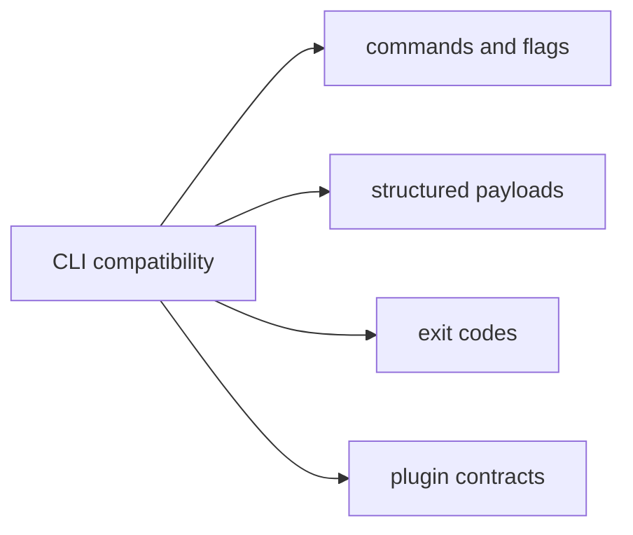

# Compatibility Commitments

This page explains what `bijux-cli` tries to keep stable as it evolves.

The point of these commitments is practical: operators, scripts, and plugin
authors should be able to tell which kinds of changes are routine and which
kinds require deliberate compatibility review.

## Compatibility Map

## Compatibility Scope

- canonical command route behavior for documented commands
- global flag semantics and parser normalization expectations
- stable exit-code categories for success, usage, and internal failures
- plugin manifest v2 and namespace conflict rules
- API facade intent for commonly consumed runtime interfaces

## Planned Flexibility

- internal module refactors that preserve public behavior
- additive command and payload fields with documented intent
- improved diagnostics detail that does not invalidate existing keys

## Code Anchors

- `crates/bijux-cli/src/routing/parser.rs`
- `crates/bijux-cli/src/interface/cli/dispatch.rs`
- `crates/bijux-cli/src/contracts/plugin.rs`
- `crates/bijux-cli/tests/routing/`
- `crates/bijux-cli/tests/integration/`

## Review Rule

When a change touches command grammar, output shape, or exit classification,
require explicit compatibility notes and targeted tests before merge.

## Reading Rule

Use this page when a change may alter what scripts, operators, or plugins rely
on. Move to Change Validation once the compatibility surface is clear and the
next question is how to prove the change is safe.

## Next Reads

- [Change Principles](../foundation/change-principles.md)
- [Change Validation](../quality/change-validation.md)
- [Release and Versioning](../operations/release-and-versioning.md)
