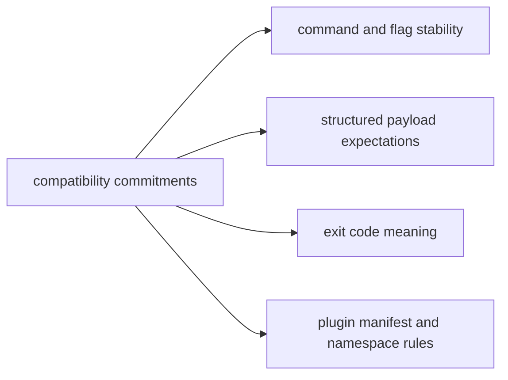

# Compatibility Commitments

Compatibility commitments define what `bijux-cli` aims to preserve across
changes so operators, scripts, and integrations can upgrade with confidence.

## Visual Summary

## Compatibility Scope

- canonical command route behavior for documented commands
- global flag semantics and parser normalization expectations
- stable exit-code categories for success, usage, and internal failures
- plugin manifest v2 and namespace conflict rules
- API facade intent for commonly consumed runtime interfaces

## Planned Flexibility

- internal module refactors that preserve public behavior
- additive command and payload fields with documented intent
- improved diagnostics detail that does not invalidate existing keys

## Code Anchors

- `crates/bijux-cli/src/routing/parser.rs`
- `crates/bijux-cli/src/interface/cli/dispatch.rs`
- `crates/bijux-cli/src/contracts/plugin.rs`
- `crates/bijux-cli/tests/routing/`
- `crates/bijux-cli/tests/integration/`

## Review Rule

When a change touches command grammar, output shape, or exit classification,
require explicit compatibility notes and targeted tests before merge.

## Next Reads

- [Change Principles](../foundation/change-principles.md)
- [Change Validation](../quality/change-validation.md)
- [Release and Versioning](../operations/release-and-versioning.md)
