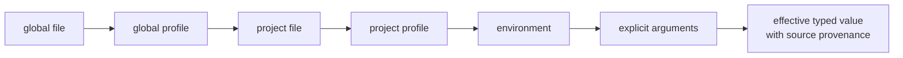

# Configuration Guide

`bijux` resolves configuration from typed layers. The effective value is not
necessarily the value in the nearest file, so diagnosis should start with the
runtime rather than with manual file inspection.

## How A Value Is Chosen

Configuration is applied from lowest to highest precedence:

1. global configuration
2. selected global profile
3. project `.bijux/config.toml` or `.bijux/config.json`
4. selected project profile
5. environment variables
6. explicit command arguments

The last defined value wins. A profile selects an overlay; it does not replace
the base document. Project files affect commands executed in that project and
must not silently rewrite global state.



Resolution is key-specific. One effective configuration can contain values
from several layers, and changing the current directory can change project
discovery without changing the global file.

## Inspect Before Changing

```bash
bijux config validate --format json --no-pretty
bijux config explain cli.log_level --format json --no-pretty
bijux config schema cli --format json --no-pretty
bijux config docs cli
```

`validate` reports malformed or unsupported values. `explain` shows the
winning source for one key. `schema` is the machine-readable contract, while
`docs` is its operator rendering. Use `repair` only after reviewing the
diagnostic because repair may rewrite invalid persisted configuration.

The reliable investigation order is:

1. resolve the active paths with `bijux cli paths`;
2. explain the disputed key;
3. validate the complete selected profile;
4. compare project and global layers when precedence is unexpected;
5. change only the highest-precedence source that is actually wrong;
6. rerun `explain` and the original command from the same directory and
   environment.

## Layer Responsibilities

| Layer | Appropriate use | Operational risk |
| --- | --- | --- |
| global file | stable user defaults shared across projects | broad impact on every invocation using that home |
| global profile | named user environment such as development or release | selecting the wrong profile changes multiple values |
| project file | settings owned by one repository or working tree | current-directory discovery can select a different project |
| project profile | repository-owned overlay for one operating mode | profile may exist globally and in the project |
| environment | deployment or job-specific override | hidden process state can defeat file inspection |
| command argument | one deliberate invocation | wrappers may silently inject the highest-precedence value |

Configuration provenance is part of the result. Copying only the final value
is insufficient when another machine must reproduce the decision.

## Profiles And Project Discovery

A selected profile overlays both applicable base documents in precedence
order. Validate with the same profile used by the workload:

```bash
bijux config validate --profile dev --format json --no-pretty
bijux config explain cli.log_level --profile dev --format json --no-pretty
```

Run the commands from the same working directory as the failing workload.
Project discovery and explicit `--config-path` selection are execution inputs,
not incidental setup details.

## Move Configuration Safely

Portable export and load commands are for moving supported values between
environments. They are not a secret transport. Sensitive values are redacted
from normal explanations and documentation; `--include-secrets` is an explicit
disclosure action and its output must be handled accordingly.

Before loading exported configuration:

- inspect the source and destination schemas;
- remove machine-specific paths and unsupported keys;
- decide how secrets will be supplied at the destination;
- load into an isolated path first;
- validate and explain critical keys before switching the workload.

Exporting a value does not preserve the environment, current directory,
profile selection, command arguments, plugin inventory, or mounted-product
state that also affected the original invocation.

## Failure Interpretation

| Symptom | Evidence to collect | Correct action |
| --- | --- | --- |
| stored value differs from effective value | `config explain` and active paths | change the winning layer or remove the unintended override |
| project value is ignored | working directory, discovered project, selected profile | correct discovery or invocation context |
| validation fails | structured issue path, source, and expected type | repair the owning source; do not coerce at the consumer |
| secret appears redacted | schema classification and source provenance | keep redaction; inspect only through a controlled disclosure path |
| repair is proposed | original file, validation report, and backup destination | preserve evidence, then review the lossy repair result |
| another machine resolves differently | all layer identities and explicit invocation inputs | compare provenance, not only final files |

## Generated Authority

[`generated-config-reference.md`](generated-config-reference.md) is generated
from the same registry used by `bijux config schema`. If the checked-in page
and runtime output differ, regenerate the page and review the schema change;
do not maintain a handwritten parallel reference.

## Continue Reading

- [Configuration Surface](configuration-surface.md)
- [State And Persistence](../architecture/state-and-persistence.md)
- [Failure Recovery](../operations/failure-recovery.md)
- [Security And Safety](../operations/security-and-safety.md)
