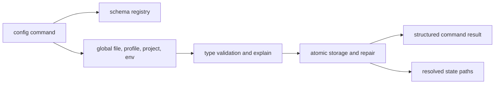

# Configuration Surface

Configuration behavior is exposed through `config` and `cli config` routes with
normalized keys, layered precedence, profile overlays, redaction-aware explain
surfaces, and deterministic import/export behavior.

## Visual Summary

## Configuration Commands

- `config` / `config list`
- `config get KEY`
- `config set KEY=VALUE`
- `config unset KEY`
- `config clear`
- `config reload`
- `config validate [--profile NAME]`
- `config schema [SCOPE]`
- `config docs [SCOPE]`
- `config explain KEY [--profile NAME]`
- `config repair`
- `config export PATH`
- `config export PATH --portable`
- `config load PATH`
- `config load PATH --portable`

## Contract Rules

- keys must be ASCII and normalized
- values must remain ASCII and control-character safe
- effective precedence is `env -> project profile -> project config -> global profile -> global file`
- project discovery uses `.bijux/config.toml` or `.bijux/config.json`
- named profiles use `.bijux/profiles/<name>.{env,toml,json}` depending on scope
- explain and portable export redact secret-like values unless secrets are explicitly requested
- repair writes a backup file before rewriting malformed global env state
- import/export uses dotenv-compatible key-value syntax for native files and a logical-key JSON bundle for portable files
- schema-backed markdown reference generation must come from the same built-in field registry as runtime validation
- command results should include status and path context where relevant

## Code Anchors

- `crates/bijux-cli/src/interface/cli/handlers/config.rs`
- `crates/bijux-cli/src/features/config/operations.rs`
- `crates/bijux-cli/src/features/config/layered.rs`
- `crates/bijux-cli/src/features/config/schema.rs`
- `crates/bijux-cli/src/features/config/validation.rs`
- `crates/bijux-cli/src/contracts/config.rs`

## Next Reads

- [State and Persistence](../architecture/state-and-persistence.md)
- [Common Workflows](../operations/common-workflows.md)
- [Change Validation](../quality/change-validation.md)
