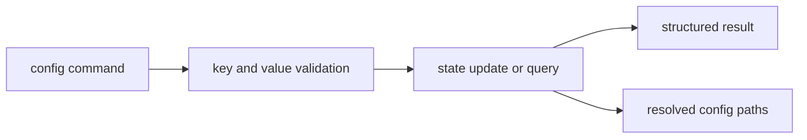

# Configuration Surface

This page explains the configuration commands that shape CLI behavior over time.

The important contract is not just that keys exist. It is that configuration
stays inspectable, importable, and predictable across machines.

## Configuration Flow

## Configuration Commands

- `config` / `config list`
- `config get KEY`
- `config set KEY=VALUE`
- `config unset KEY`
- `config clear`
- `config reload`
- `config export PATH`
- `config load PATH`

## Contract Rules

- keys must be ASCII and normalized
- values must remain ASCII and control-character safe
- import/export uses dotenv-compatible key-value syntax
- command results should include status and path context where relevant

## Code Anchors

- `crates/bijux-cli/src/interface/cli/handlers/config.rs`
- `crates/bijux-cli/src/features/config/operations.rs`
- `crates/bijux-cli/src/features/config/validation.rs`
- `crates/bijux-cli/src/contracts/config.rs`

## Reading Rule

Use this page when CLI behavior depends on saved settings and the real question
is whether the issue is in config input, validation, storage, or import/export.

## Next Reads

- [State and Persistence](../architecture/state-and-persistence.md)
- [Common Workflows](../operations/common-workflows.md)
- [Change Validation](../quality/change-validation.md)
