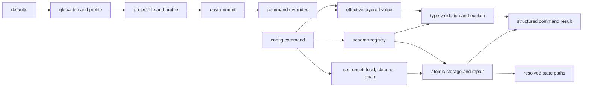

# Configuration Surface

Configuration behavior is exposed through `config` and `cli config` routes with
normalized keys, layered precedence, profile overlays, redaction-aware explain
surfaces, and deterministic import/export behavior.

The important contract is not just that keys exist. It is that configuration
stays inspectable, importable, and predictable across machines.

## Configuration Flow

Arrows in the precedence chain move from lower to higher precedence. Within
file-backed layers, the project profile overrides the project file, and the
global profile overrides the global file. `config explain` is the diagnostic
surface for identifying the winning source.

## Configuration Commands

- `config` / `config list`
- `config get KEY`
- `config set KEY=VALUE`
- `config unset KEY`
- `config clear`
- `config reload`
- `config validate [--profile NAME]`
- `config schema [SCOPE]`
- `config docs [SCOPE]`
- `config explain KEY [--profile NAME]`
- `config repair`
- `config export PATH`
- `config export PATH --portable`
- `config load PATH`
- `config load PATH --portable`

## Contract Rules

- keys must be ASCII and normalized
- values must remain ASCII and control-character safe
- effective precedence is `env -> project profile -> project config -> global profile -> global file`
- project discovery uses `.bijux/config.toml` or `.bijux/config.json`
- named profiles use `.bijux/profiles/<name>.{env,toml,json}` depending on scope
- explain and portable export redact secret-like values unless secrets are explicitly requested
- repair writes a backup file before rewriting malformed global env state
- import/export uses dotenv-compatible key-value syntax for native files and a logical-key JSON bundle for portable files
- schema-backed markdown reference generation must come from the same built-in field registry as runtime validation
- command results should include status and path context where relevant

## Two Precedence Questions

The runtime resolves two related but distinct classes of input:

| Question | Precedence | Diagnostic |
| --- | --- | --- |
| which logical configuration value wins? | defaults, global file, global profile, project file, project profile, environment, command overrides | `config explain KEY` and `config validate` |
| where are config, history, and plugin state located? | explicit CLI path, environment path override, compatibility config, home-derived default | `cli paths`, `status`, and `doctor` |

Do not use a logical value explanation to infer a state path, or a path report
to infer which profile value won. They have separate contracts because path
resolution must happen before file-backed values can be loaded.

## Safe Mutation Workflow

1. inspect the current value with `config explain KEY`;
2. inspect the schema before changing an unfamiliar key;
3. write to the intended global or project scope;
4. run `config validate` for the selected profile;
5. explain the value again and confirm the winning source;
6. use portable export only when logical keys, not host-specific paths, should
   cross machines.

Treat secret redaction as an output safety boundary, not encryption. A portable
bundle that deliberately includes secrets requires the same storage and review
controls as the source credentials.

## Failure Decisions

| Failure | Interpretation | Response |
| --- | --- | --- |
| key is unknown or value has the wrong type | schema validation failure | correct the key/value; do not bypass validation with a differently formatted file |
| expected project value does not win | discovery, profile, environment, or command override has higher precedence | inspect `config explain` and effective paths before editing files |
| global state is malformed | storage cannot be parsed safely | use repair so the original is backed up before rewrite |
| portable import changes host paths | host-specific values were carried as logical configuration | review the bundle and remove values that must be resolved per host |
| explain output reveals secret material | redaction contract failure | stop sharing output and repair the owning schema/redaction rule |

## Code Anchors

- `crates/bijux-cli/src/interface/cli/handlers/config.rs`
- `crates/bijux-cli/src/features/config/operations.rs`
- `crates/bijux-cli/src/features/config/layered.rs`
- `crates/bijux-cli/src/features/config/schema.rs`
- `crates/bijux-cli/src/features/config/validation.rs`
- `crates/bijux-cli/src/contracts/config.rs`

## Reading Rule

Use this page when CLI behavior depends on saved settings and the real question
is whether the issue is in config input, validation, storage, or import/export.

## Next Reads

- [State and Persistence](../architecture/state-and-persistence.md)
- [Common Workflows](../operations/common-workflows.md)
- [Change Validation](../quality/change-validation.md)
