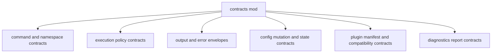

# Data Contracts

`bijux-cli` contract types define stable payload semantics for command paths,
execution policy, envelopes, diagnostics, config state, and plugin manifests.

## Visual Summary

## Contract Families

- command path and namespace normalization
- execution flags and policy representation
- success/error envelope payloads
- config read/write and mutation payloads
- plugin lifecycle and compatibility declarations
- diagnostics and route inventory records

## Code Anchors

- `crates/bijux-cli/src/contracts/mod.rs`
- `crates/bijux-cli/src/contracts/command.rs`
- `crates/bijux-cli/src/contracts/execution.rs`
- `crates/bijux-cli/src/contracts/envelope.rs`
- `crates/bijux-cli/src/contracts/plugin.rs`
- `crates/bijux-cli/src/contracts/diagnostics.rs`

## Contract Rules

- add validation at construction boundaries where possible
- keep schema-bearing structs serializable and reviewable
- treat field removals/renames as compatibility-impacting changes
- keep examples and docs aligned with actual struct behavior

## Next Reads

- [Artifact Contracts](artifact-contracts.md)
- [Compatibility Commitments](compatibility-commitments.md)
- [Invariants](../quality/invariants.md)
