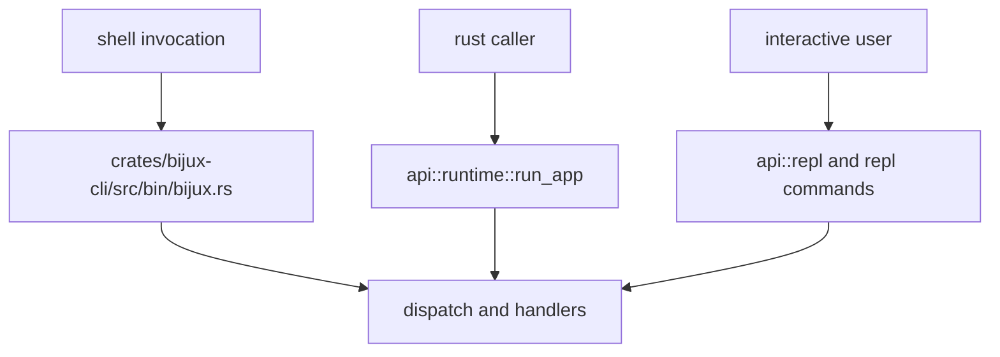

# Entrypoints and Examples

Use this page to choose an invocation boundary. Command behavior belongs to
the [CLI Surface](cli-surface.md); operational sequencing belongs to
[Operator Workflows](operator-workflows.md).

When an official product app also ships its own public binary, prefer that
binary for operator procedures. For DAG, that means `bijux-dag ...` remains the
authoritative operator surface, while `bijux dag ...` stays a root-managed
delegation form.

## Visual Summary



## Entrypoints

| Caller | Boundary | Use it when |
| --- | --- | --- |
| human or shell automation | `bijux` binary | the installed command, stream behavior, and process exit code are part of the contract |
| Rust host | `api::runtime::run_app` | the host needs the same routing and result semantics without spawning a child process |
| parser integration | `api::parser::parse_intent` | the caller needs intent parsing without execution |
| interactive integration | `api::repl` | the caller owns an interactive session |

## Command Examples

```bash
bijux status --format json --no-pretty
bijux config set theme=compact
bijux plugins list
bijux history --limit 20 --sort timestamp
bijux repl
```

For the DAG product boundary itself, use the
[DAG release boundary](../../bijux-dag/foundation/release-boundary.md),
which is backed by the machine-readable contract
`contracts/foundation/dag_release_truth_table.v1.json`, instead of inferring
stable support from routed root examples.

## Rust Caller Example

```rust
use bijux_cli::api::runtime::run_app;

let argv = vec!["bijux".to_string(), "status".to_string()];
let result = run_app(&argv)?;
assert_eq!(result.exit_code, 0);
```

## Code Anchors

- `crates/bijux-cli/src/bin/bijux.rs`
- `crates/bijux-cli/src/api/runtime.rs`
- `crates/bijux-cli/src/api/parser.rs`
- `crates/bijux-cli/src/api/repl.rs`

## Next Reads

- [CLI Surface](cli-surface.md)
- [Operator Workflows](operator-workflows.md)
- [Local Development](../operations/local-development.md)
