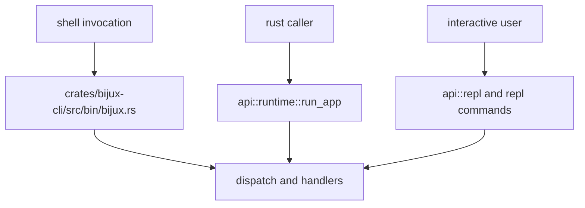

# Entrypoints and Examples

This page documents the primary invocation entrypoints for users, scripts, and
Rust callers, plus short examples that map directly to current behavior.

When an official product app also ships its own public binary, prefer that
binary for operator procedures. For DAG, that means `bijux-dag ...` remains the
authoritative operator surface, while `bijux dag ...` stays a root-managed
delegation form.

## Visual Summary



## Entrypoints

- process binary: `bijux` via `crates/bijux-cli/src/bin/bijux.rs`
- Rust runtime API: `api::runtime::run_app` and `run_cli_from_env`
- parser API: `api::parser::parse_intent`
- REPL API: `api::repl::*`

## Command Examples

```bash
bijux status --format json --no-pretty
bijux config set theme=compact
bijux plugins list
bijux history --limit 20 --sort timestamp
bijux repl
```

For the DAG product boundary itself, use the
[DAG release boundary](../../bijux-dag/foundation/release-boundary.md),
which is backed by the machine-readable contract
`contracts/foundation/dag_release_truth_table.v1.json`, instead of inferring
stable support from routed root examples.

## Rust Caller Example

```rust
use bijux_cli::api::runtime::run_app;

let argv = vec!["bijux".to_string(), "status".to_string()];
let result = run_app(&argv)?;
assert_eq!(result.exit_code, 0);
```

## Code Anchors

- `crates/bijux-cli/src/bin/bijux.rs`
- `crates/bijux-cli/src/api/runtime.rs`
- `crates/bijux-cli/src/api/parser.rs`
- `crates/bijux-cli/src/api/repl.rs`

## Next Reads

- [CLI Surface](cli-surface.md)
- [Operator Workflows](operator-workflows.md)
- [Local Development](../operations/local-development.md)
