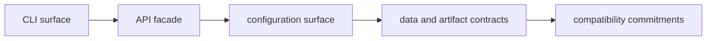

# CLI Interfaces

The interfaces section defines what external callers can depend on: command
surface, API facade modules, configuration behavior, typed data contracts, and
compatibility commitments.

## Visual Summary

## Interface Families

- command-line routes and global flags
- public Rust API modules under `src/api`
- config/state command behavior and file contracts
- envelope and plugin manifest schemas
- cross-version compatibility rules for scripts and integrations

## Code Anchors

- `crates/bijux-cli/src/routing/parser.rs`
- `crates/bijux-cli/src/interface/cli/handlers/`
- `crates/bijux-cli/src/api/`
- `crates/bijux-cli/src/contracts/`
- `crates/bijux-cli/tests/routing/`

## Pages In This Section

- [CLI Surface](cli-surface.md)
- [API Surface](api-surface.md)
- [Configuration Surface](configuration-surface.md)
- [Data Contracts](data-contracts.md)
- [Artifact Contracts](artifact-contracts.md)
- [Entrypoints and Examples](entrypoints-and-examples.md)
- [Operator Workflows](operator-workflows.md)
- [Public Imports](public-imports.md)
- [Compatibility Commitments](compatibility-commitments.md)
