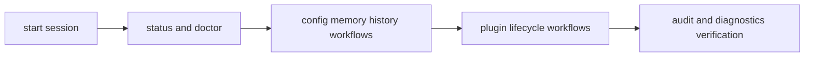

# Operator Workflows

Operator workflows in `bijux-cli` focus on repeatable status checks, state
management, plugin lifecycle control, and diagnostics-driven triage.

## Visual Summary

## Core Workflows

- baseline health: `status`, `doctor`, `audit`
- configuration updates: `config set/get/export/load`
- session memory and history review: `memory ...`, `history ...`
- plugin management: `plugins install/check/enable/disable/uninstall`
- path and environment discovery: `cli paths`, `plugins where`

## Workflow Rules

- run status/doctor before deep debugging changes
- prefer structured output for script automation
- validate plugin health after install or compatibility updates
- keep config changes explicit and exportable for reproducibility

## Code Anchors

- `crates/bijux-cli/src/interface/cli/handlers/cli.rs`
- `crates/bijux-cli/src/interface/cli/handlers/config.rs`
- `crates/bijux-cli/src/interface/cli/handlers/history.rs`
- `crates/bijux-cli/src/interface/cli/handlers/memory.rs`
- `crates/bijux-cli/src/interface/cli/handlers/plugins.rs`

## Next Reads

- [Common Workflows](../operations/common-workflows.md)
- [Observability and Diagnostics](../operations/observability-and-diagnostics.md)
- [Review Checklist](../quality/review-checklist.md)
